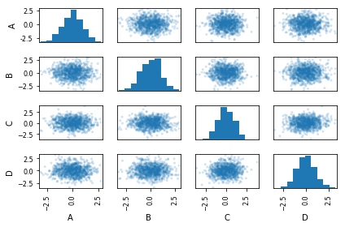
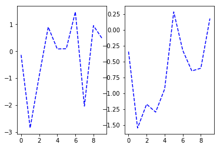
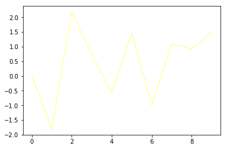
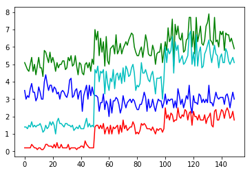

```python
%matplotlib inline


# Pair Graph
import numpy as np
import pandas as pd
import matplotlib.pyplot as plt 


```


```python
df = pd.DataFrame(np.random.randn(1000, 4), columns=['A','B','C','D'])
axes = pd.tools.plotting.scatter_matrix(df, alpha=0.2)
plt.tight_layout()

```


    

    


```python
# Base
%matplotlib inline
from matplotlib import pyplot as plt
import numpy as np
fig = plt.figure()
ax1 = fig.add_subplot(1, 2, 1)
ax2 = fig.add_subplot(1, 2, 2)
ax1.plot(np.random.randn(10), linestyle = '--', color = 'b')
ax2.plot(np.random.randn(10), linestyle = '--', color = 'b')
# fig.show()
```


    

    


```python
import numpy as np
fig = plt.figure()
ax1 = fig.add_subplot(1, 1, 1)
ax1.plot(np.random.randn(10), linestyle = ':', color = '#FFFF00')
#fig.show()
#help(ax1.plot)
```


    

    


```python
# Data + Example
import numpy as np
#help(np.loadtxt)
data=np.loadtxt('iris_data.csv',delimiter=',')
label= np.repeat([1,2,3], 50)
# data[:,1]
```


```python
# 기본 그래프
fig = plt.figure()
ax1 = fig.add_subplot(1, 1, 1)
ax1.plot(data[:,1], linestyle = '-', color = 'g')
ax1.plot(data[:,2], linestyle = '-', color = 'b')
ax1.plot(data[:,3], linestyle = '-', color = 'c')
ax1.plot(data[:,4], linestyle = '-', color = 'r')
```


    

    


```python
help(np.loadtxt)
```


```python

```


```python

```


```python

```


```python

```


```python

```
