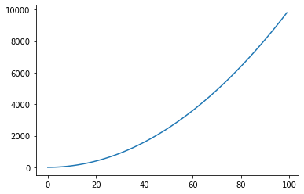

```python
%matplotlib inline
import matplotlib.pyplot as plt
x = range(100)
y = [ i*i for i in x]
plt.plot(x,y)
```


    

    


```python
import numpy as np
data=np.array(range(12)).reshape(3,4)
lbl=np.array(range(3)).reshape(3,1)
```


```python
np.array(range(12)).reshape(3,4)
```


```python
(lbl.shape,data.shape)
```


```python
np.hstack( (data,lbl))
```


```python

```


```python

```


```python

```


```python

```


```python

```


```python

```


```python

```


```python

```
