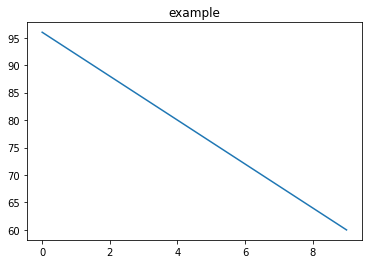

# Interact

colab 에서 활용 가능한 interact 에 대해 알아본다.
* https://ipywidgets.readthedocs.io/en/latest/examples/Using%20Interact.html
* https://colab.research.google.com/github/jupyter-widgets/ipywidgets/blob/master/docs/source/examples/Using%20Interact.ipynb

## String and Slider
슬라이딩 바를 통해 변수 값을 조정하는 것이 가능하다.


```python
s = 'example'  #@param {type: "string"}
a = -4  #@param {type: "slider", min: -10, max: 10}
b= 96  #@param {type: "slider", min: 0, max: 100}


```

위의 값을 바꾼 뒤에 해당 그래프를 출력해보면 값이 바뀌는 것을 확인할 수 있다.<br>
(값을 바꾼 뒤 위 코드를 한번 실행을 해서 변경값을 적용해줘야 한다.)


```python
import matplotlib.pyplot as plt
plt.title(s)
ns=range(10)
plt.plot(ns,[i*a+b for i in ns])
```


    

    


## Markdown 을 활용한 Form
Markdown 의 형식을 빌려서 폼 형태를 만드는 것도 가능하다.


```python
#@title Example form fields
#@markdown Forms support many types of fields.

no_type_checking = ''  #@param
string_type = 'example'  #@param {type: "string"}
slider_value = 142  #@param {type: "slider", min: 100, max: 200}
number = 102  #@param {type: "number"}
date = '2010-11-05'  #@param {type: "date"}
pick_me = "monday"  #@param ['monday', 'tuesday', 'wednesday', 'thursday']
select_or_input = "apples" #@param ["apples", "bananas", "oranges"] {allow-input: true}
#@markdown ---

```

# interact 기초


```python
from __future__ import print_function
from ipywidgets import interact, interactive, fixed, interact_manual
import ipywidgets as widgets


def f(x):
    return x
interact(f, x=10);
```

# interact 그래프


```python
%matplotlib inline
from ipywidgets import interactive
import matplotlib.pyplot as plt
import numpy as np

def f(m, b):
    plt.figure(2)
    x = np.linspace(-10, 10, num=1000)
    plt.plot(x, m * x + b)
    plt.ylim(-5, 5)
    plt.show()

interactive_plot = interactive(f, m=(-2.0, 2.0), b=(-3, 3, 0.5))
output = interactive_plot.children[-1]
output.layout.height = '350px'
interactive_plot
```
