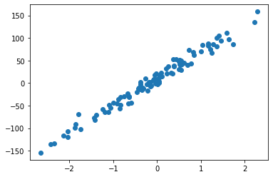
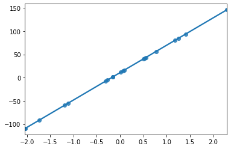

# Data loading

## 필요 라이브러리 선언


```
from sklearn.datasets import make_regression
import numpy as np
import matplotlib.pyplot as plt
import tensorflow as tf

```

## Dummy Data 만들기

### make_regression 함수를 통한 생성


```
X, y = make_regression(n_samples=100, n_features=1, bias=10.0, noise=10.0, random_state=2)

```

### a=2, B=1 인 더미데이터 생성 예시


```
# x_org = [1,2 , 3 , 4   ,5]
# y_org = [3,5 , 7 ,9.1   ,11.1 ]

# X = np.array(x_org)
# y = np.array(y_org)
# X=X.reshape( [5,-1])
# y=y.reshape( [5,-1])
# print(X.shape)
# print(y.shape)


```

y 값에 차원 추가


```
y = np.expand_dims(y, axis=1)
y.shape
```

### Data 분석


```
print(X.shape)
print(y.shape)

plt.scatter(X, y)
plt.show()
```


    

    


# Regression Example by Keras

## 훈련데이터와 평가데이터를 나눠주기


```
train_x = X[:80]
test_x = X[80:]

train_y = y[:80]
test_y = y[80:]

```

## Model 만들기


```
model = tf.keras.Sequential()
model.add(tf.keras.layers.Dense(1, activation='linear'))
optimizer = tf.keras.optimizers.SGD(0.01)
model.compile(loss='mse', optimizer=optimizer, metrics=['mse'])

```

## Model 훈련


```
model.fit(train_x, train_y, batch_size=10, epochs=100, shuffle=True)        

```


    <tensorflow.python.keras.callbacks.History at 0x7f96bdbd0050>


```
6.6546e+10
```

### Hidden Layer의 weights 값 보기


```
# dir(model)
# dir(model.layers[0])
model.layers[0].weights
```

# 모델 평가

### test 데이터의 일부를 활용해 직접 확인해보기

y 값 확인


```
test_y[0:4]
```

x 값 확인


```
test_x[0:4]
```

확인한 x 값을 돌려서 나온 결과물을 위의 y값 확인 한 것과 비교해본다.


```
model.predict(test_x[0:4])

```

## 임의의 값으로 확인해보기


```
xx=np.array([[9]])
xx.shape
```


```
model.predict( xx )
```


```
model.predict( np.array([[0]]) )
```

## test 데이터를 활용해 평가하기


```
model.evaluate(test_x, test_y)
```


    [101.58915710449219, 101.58915710449219]


```
import seaborn as sns
sns.regplot(x=test_x,y=model.predict(test_x),fit_reg=True)

```


    

    


```

```
