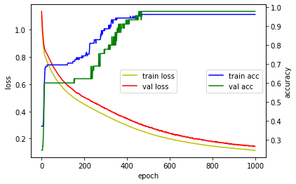

# 4. Model의 Training과정을 확인과 Keras의 Callback 기능

## hist_view 함수 만들기
모델의 트레이닝과정을 TEXT 로만 보면 어떻게 되고 있는지 알기 힘들다. 그래서 눈에 잘 보이게끔 TEXT의 내용을 그래프의 형태로 바꿔 주는 함수를 만들어주었다.


```
import numpy as np
from tensorflow import keras
from tensorflow.keras.models import Sequential
from tensorflow.keras.layers import Dense
import matplotlib.pyplot as plt
def hist_view(hist):
  print('## training loss and acc ##')
  fig, loss_ax = plt.subplots()
  acc_ax = loss_ax.twinx()

  loss_ax.plot(hist.history['loss'], 'y', label='train loss')
  loss_ax.plot(hist.history['val_loss'], 'r', label='val loss')

  loss_ax.set_xlabel('epoch')
  loss_ax.set_ylabel('loss')
  loss_ax.legend(loc='center')

  acc_ax.plot(hist.history['accuracy'], 'b', label='train acc')
  acc_ax.plot(hist.history['val_accuracy'], 'g', label='val acc')
  acc_ax.set_ylabel('accuracy')
  acc_ax.legend(loc='center right')

  plt.show()
```

## 모델 만들기


```
from sklearn import datasets
iris = datasets.load_iris()
x=iris.data
y= keras.utils.to_categorical(iris.target, 3)

from sklearn.model_selection import train_test_split
x_train,x_test,y_train,y_test=train_test_split(x,y,test_size=0.3,random_state=0)
x_train.shape,x_test.shape,y_train.shape,y_test.shape

```


```
model = Sequential()
model.add(Dense(5, activation='relu', input_shape=(4,)))
model.add(Dense(3, activation='softmax'))
model.summary()

```


```
model.compile(loss='categorical_crossentropy',
              optimizer='adam',
              metrics=['accuracy'])

```

## 훈련 


```
from tensorflow.keras.callbacks import EarlyStopping
early_stopping = EarlyStopping(monitor='val_loss', patience=25)

hist=model.fit(x_train, y_train,
          batch_size=10,
          epochs=1000,
          verbose=1,
          validation_data=(x_test, y_test),
          callbacks=[early_stopping])

```

## hist_view 함수의 활용
위의 훈련에서 model.fit() 값을 받아온 hist 를 넘겨주어 해당 내역을 그래프로 바꾼다.


```
hist_view(hist)
score = model.evaluate(x_test, y_test, verbose=0)
print('Test loss:', score[0])
print('Test accuracy:', score[1])
```


    

    


    Test loss: 0.1435558795928955
    Test accuracy: 0.9777777791023254


## Decoder


```
decoder = {k:v for k,v in enumerate( iris.target_names )}
```


```
r=np.argmax(model.predict(x_test[:10,:]), axis=-1)
[decoder[i] for i in r]
```

# 이제 Hyper Parameter를 수정해서 모델의 성능을 높이고 싶다. 
