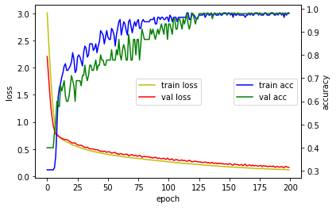

# 6. Hidden Layer도 추가하고, Hidden Layer에 들어가는 Perceptron 숫자들도 바꿔보기


Hyper Parameter 설정


```
batch_size = 10
epochs = 200
```

## Hidden Layer Perceptron 갯수 조정


```
num_classes = 3
```

모델에 필요한 함수 및 라이브러리 선언


```
import numpy as np
from tensorflow import keras
from tensorflow.keras.models import Sequential
from tensorflow.keras.layers import Dense
import matplotlib.pyplot as plt
def hist_view(hist):
  print('## training loss and acc ##')
  fig, loss_ax = plt.subplots()
  acc_ax = loss_ax.twinx()

  loss_ax.plot(hist.history['loss'], 'y', label='train loss')
  loss_ax.plot(hist.history['val_loss'], 'r', label='val loss')

  loss_ax.set_xlabel('epoch')
  loss_ax.set_ylabel('loss')
  loss_ax.legend(loc='center')

  acc_ax.plot(hist.history['accuracy'], 'b', label='train acc')
  acc_ax.plot(hist.history['val_accuracy'], 'g', label='val acc')
  acc_ax.set_ylabel('accuracy')
  acc_ax.legend(loc='center right')

  plt.show()
```

Data Setting


```
from sklearn import datasets
iris = datasets.load_iris()
x=iris.data

y= keras.utils.to_categorical(iris.target, num_classes)

from sklearn.model_selection import train_test_split
x_train,x_test,y_train,y_test=train_test_split(x,y,test_size=0.3,random_state=0)
x_train.shape,x_test.shape,y_train.shape,y_test.shape

```

모델 만들기

## hidden layer 추가
추가한 Hidden Layer 에 num_classes 를 통해 Hidden Layer의 Perceptron 갯수가 조정 된다.


```
model = Sequential()
model.add(Dense(6, activation='relu', input_shape=(4,)))
# add 를 통해 Hidden Layer 를 추가해준다.
model.add(Dense(4, activation='relu'))
model.add(Dense(num_classes, activation='softmax'))
model.summary()

```

모델의 Function 정의


```
model.compile(loss='categorical_crossentropy',
              optimizer='adam',
              metrics=['accuracy'])

```

모델 훈련


```
# batch_size,epochs
hist=model.fit(x_train, y_train,
          batch_size=batch_size,
          epochs=epochs,
          verbose=1,
          validation_data=(x_test, y_test))


```

## 결과확인


```
hist_view(hist)
score = model.evaluate(x_test, y_test, verbose=0)
print('Test loss:', score[0])
print('Test accuracy:', score[1])

```


    

    


    Test loss: 0.16173213720321655
    Test accuracy: 0.9777777791023254


```
decoder = {k:v for k,v in enumerate( iris.target_names )}
```


```
r=np.argmax(model.predict(x_test[:10,:]), axis=-1)
[decoder[i] for i in r]
```

# 샘플 데이터가 아닌 나의 데이터로 분석해 보고 싶다. 
