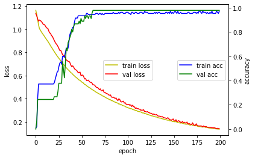

# 7. CSV파일을 Load해서 분석해 보고 싶다. 
* Target이 String형태임에 주의
* 1차 인코딩 : String → Num
* 2차 인코딩(One Hot Encoding) : Num  → array  
  - ex) 2 → [0,0,1] , 1 → [0,1,0]

## Hyper Parameter 설정


```
batch_size = 10
num_classes = 3
epochs = 200
```

## 라이브러리 및 함수 선언


```
import numpy as np
from tensorflow import keras
from tensorflow.keras.models import Sequential
from tensorflow.keras.layers import Dense
import matplotlib.pyplot as plt
def hist_view(hist):
  print('## training loss and acc ##')
  fig, loss_ax = plt.subplots()
  acc_ax = loss_ax.twinx()

  loss_ax.plot(hist.history['loss'], 'y', label='train loss')
  loss_ax.plot(hist.history['val_loss'], 'r', label='val loss')

  loss_ax.set_xlabel('epoch')
  loss_ax.set_ylabel('loss')
  loss_ax.legend(loc='center')

  acc_ax.plot(hist.history['accuracy'], 'b', label='train acc')
  acc_ax.plot(hist.history['val_accuracy'], 'g', label='val acc')
  acc_ax.set_ylabel('accuracy')
  acc_ax.legend(loc='center right')

  plt.show()
```

## 직접 데이터 로딩
라이브러리에서 제공하는 데이터가 아닌 자신이 갖고 있는 CSV 파일을 가져옵니다.


```
# 기존 코드
# from sklearn import datasets
# iris = datasets.load_iris()
# x=iris.data

# 데이터 다운로드와 로딩
import pandas as pd
![ ! -f  iris0.csv ]&&wget http://j.finfra.com/_file/iris0.csv
iris=pd.read_csv("iris0.csv")


```

참고사항.
- wget을 활용하는 것이 아닌 좌측 파일 탐색기에 드래그를 통해 파일을 올려서 로드를 할 수도 있습니다.

## 컬럼 추출
데이터 셋과 결과값을 분리해줍니다.


```
iris.head()
```

위의 결과를 보면 0 , 1 , 2 , 3 이 데이터 셋이고, 4 가 결과인 것을 알 수 있습니다.<BR>
이것에 맞춰 X 와 Y 를 분리해 줍니다.


```
x=iris.iloc[:,0:4].values
y_text=iris.iloc[:,4:5]

```

## 1차 인코딩
가져온 Y 데이터의 값은 문자열 형태인데 이것을 1차로 0, 1, 2 의 숫자로 인코딩해 줍니다.


```
sets=y_text.drop_duplicates()["Species"].tolist()
encoder={k:v for v,k in enumerate(sets)}
y_num=[ encoder[i] for i in y_text["Species"].tolist() ]


```

## One-hot Encoding
조금 더 높은 확률로 결과물이 나올 수 있도록 One-hot Encoding 을 해줍니다.


```
# One-hot Encoding
# iris.target → y
y= keras.utils.to_categorical(y_num, num_classes)

```

One-hot Encoding 의 결과는 다음과 같습니다.<BR>
0 = [1, 0, 0], 1 = [0, 1, 0], 2 = [0, 0, 1]


```
y[0]
```

## 훈련 데이터와 평가 데이터 분리


```

from sklearn.model_selection import train_test_split
x_train,x_test,y_train,y_test=train_test_split(x,y,test_size=0.3,random_state=0)
x_train.shape,x_test.shape,y_train.shape,y_test.shape

```

## 모델 만들기


```
model = Sequential()
model.add(Dense(6, activation='relu', input_shape=(4,)))
model.add(Dense(4, activation='relu'))
model.add(Dense(num_classes, activation='softmax'))
model.summary()

```


```
model.compile(loss='categorical_crossentropy',
              optimizer='adam',
              metrics=['accuracy'])

```

## Hyper Parameter를 적용해서 훈련


```
# batch_size,epochs
hist=model.fit(x_train, y_train,
          batch_size=batch_size,
          epochs=epochs,
          verbose=0,
          validation_data=(x_test, y_test))


```

## 결과 확인


```
hist_view(hist)
score = model.evaluate(x_test, y_test, verbose=0)
print('Test loss:', score[0])
print('Test accuracy:', score[1])

```


    

    


    Test loss: 0.13920484483242035
    Test accuracy: 0.9777777791023254


```
decoder = {k:v for k,v in enumerate( sets )}
decoder
```


```
r=np.argmax(model.predict(x_test[:10,:]), axis=-1)
[decoder[i] for i in r]
```

# 활성함수(Activation함수)를 수정하고 싶다.
