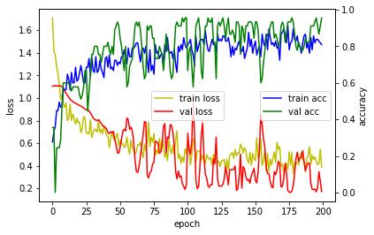

# 10. Drop out과 Batch Normalization 적용해 보기
* Drop out : Overfitting 해결 위해
* Batch Normalization : vanishing/exploding gradient 문제 해결 위해(layer 수가 많아지면 많아질수록 누적되어 발생)

hyper parameter 설정


```
batch_size = 10
num_classes = 3
epochs = 200
```

라이브러리 및 함수 설정


```
import numpy as np
from tensorflow import keras
from tensorflow.keras.models import Sequential
from tensorflow.keras.layers import Dense
from keras import optimizers

import matplotlib.pyplot as plt
def hist_view(hist):
  print('## training loss and acc ##')
  fig, loss_ax = plt.subplots()
  acc_ax = loss_ax.twinx()

  loss_ax.plot(hist.history['loss'], 'y', label='train loss')
  loss_ax.plot(hist.history['val_loss'], 'r', label='val loss')

  loss_ax.set_xlabel('epoch')
  loss_ax.set_ylabel('loss')
  loss_ax.legend(loc='center')

  acc_ax.plot(hist.history['accuracy'], 'b', label='train acc')
  acc_ax.plot(hist.history['val_accuracy'], 'g', label='val acc')
  acc_ax.set_ylabel('accuracy')
  acc_ax.legend(loc='center right')

  plt.show()
```

데이터 로드


```
# from sklearn import datasets
# iris = datasets.load_iris()
# x=iris.data
import pandas as pd
![ ! -f  iris0.csv ]&&wget http://j.finfra.com/_file/iris0.csv
iris=pd.read_csv("iris0.csv")


```

input data 와 target data 설정


```
x=iris.iloc[:,0:4].values
y_text=iris.iloc[:,4:5]

sets=y_text.drop_duplicates()["Species"].tolist()
encoder={k:v for v,k in enumerate(sets)}
y_num=[ encoder[i] for i in y_text["Species"].tolist() ]


```

train data 와 test data 나눠주기


```
# iris.target → y
y= keras.utils.to_categorical(y_num, num_classes)

from sklearn.model_selection import train_test_split
x_train,x_test,y_train,y_test=train_test_split(x,y,test_size=0.3,random_state=0)
x_train.shape,x_test.shape,y_train.shape,y_test.shape

```

## Model 에 Dropout & BatchNormalization 적용하기
- Dropout<br>
해당 layer의 weight 의 업데이트를 막아준다.
- BatchNormalization<br>
weight 값들을 Normalization 해주어서 다른 곳으로 튀어나가는 것을 막아줌. 


```
from keras.layers import BatchNormalization, Dropout

model = Sequential()

model.add(Dense(6, activation='relu', input_shape=(4,)))

model.add(Dense(4, activation='relu'))

model.add(Dense(4, activation='relu'))
model.add(BatchNormalization())

model.add(Dense(4, activation='relu'))
model.add(Dropout(0.2))

model.add(Dense(4, activation='relu'))
model.add(BatchNormalization())
model.add(Dropout(0.2))

model.add(Dense(num_classes, activation='softmax'))
model.summary()

```


```
adam=optimizers.adam_v2.Adam(0.001)
model.compile(loss='categorical_crossentropy',
              optimizer=adam,
              metrics=['accuracy'])

```

훈련하기


```
# batch_size,epochs
hist=model.fit(x_train, y_train,
          batch_size=batch_size,
          epochs=epochs,
          verbose=0,
          validation_data=(x_test, y_test))


```

결과 확인


```
hist_view(hist)
score = model.evaluate(x_test, y_test, verbose=0)
print('Test loss:', score[0])
print('Test accuracy:', score[1])

```


    

    


    Test loss: 0.17229534685611725
    Test accuracy: 0.9555555582046509


```
decoder = {k:v for k,v in enumerate( sets )}
decoder
```


```
r=np.argmax(model.predict(x_test[:10,:]), axis=-1)
[decoder[i] for i in r]
```

# Overfitting을 줄이기 위한 또 다른 방법은? Regularization!
