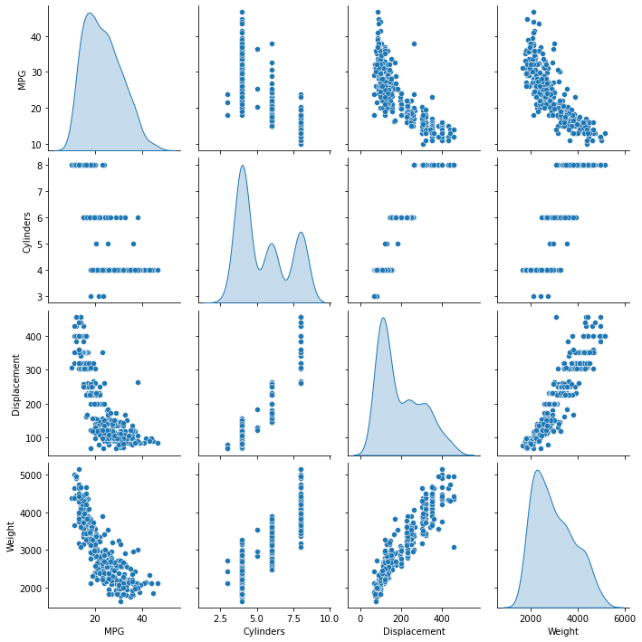

# 12. 아주 간단한 버전의 MLP-Regressor

https://www.tensorflow.org/tutorials/keras/regression?hl=ko

## library
최소한으로 필요한 라이브러리들 선언


```
import numpy as np
import pathlib

import matplotlib.pyplot as plt
import pandas as pd
import seaborn as sns
import tensorflow as tf
from tensorflow.keras import layers
from tensorflow import keras
from tensorflow.keras.models import Sequential
from tensorflow.keras.layers import Dense
```


```
from keras.wrappers.scikit_learn import KerasRegressor
from sklearn.model_selection import cross_val_score
from sklearn.model_selection import KFold
from sklearn.preprocessing import StandardScaler
from sklearn.pipeline import Pipeline
```

## 데이터 셋 불러오기
연비 데이터셋 활용


```
dataset_path = keras.utils.get_file("auto-mpg.data", "http://archive.ics.uci.edu/ml/machine-learning-databases/auto-mpg/auto-mpg.data")
dataset_path
```


```
raw_dataset = pd.read_csv(dataset_path)
raw_dataset
```


```
column_names = ['MPG','Cylinders','Displacement','Horsepower','Weight',
                'Acceleration', 'Model Year', 'Origin']
raw_dataset = pd.read_csv(dataset_path, names=column_names,
                      na_values = "?", comment='\t',
                      sep=" ", skipinitialspace=True)

dataset = raw_dataset.copy()
dataset.head()
```

NaN 값을 찾아준다.


```
dataset.isna().sum()
```


```
dataset = dataset.dropna()
```

Origin 을 one-hot 인코딩해준다.


```
origin = dataset.pop('Origin')
```


```
dataset['USA'] = (origin == 1)*1.0
dataset['Europe'] = (origin == 2)*1.0
dataset['Japan'] = (origin == 3)*1.0
dataset.tail()
```


```
train_dataset = dataset.sample(frac=0.8,random_state=0)
test_dataset = dataset.drop(train_dataset.index)
```


```
sns.pairplot(train_dataset[["MPG", "Cylinders", "Displacement", "Weight"]], diag_kind="kde")
```


    

    


```
train_stats = train_dataset.describe()
train_stats.pop("MPG")
train_stats = train_stats.transpose()
train_stats
```


```
train_labels = train_dataset.pop('MPG')
test_labels = test_dataset.pop('MPG')
```


```
def norm(x):
  return (x - train_stats['mean']) / train_stats['std']
normed_train_data = norm(train_dataset)
normed_test_data = norm(test_dataset)
```

## 모델 구성
간단하게 모델 구성하기


```
def build_model():
  model = keras.Sequential([
    layers.Dense(64, activation='relu', input_shape=[len(train_dataset.keys())]),
    layers.Dense(64, activation='relu'),
    layers.Dense(1)
  ])

  optimizer = tf.keras.optimizers.RMSprop(0.001)

  model.compile(loss='mse',
                optimizer=optimizer,
                metrics=['mae', 'mse'])
  return model
model = build_model()
```


```

model.summary()
```

## 모델 학습 및 테스트 결과 보기
fit을 통해 학습을 하고 score 확인


```
history = model.fit(
  normed_train_data, train_labels,
  epochs=100, validation_split = 0.2, verbose=2)
```


```
hist = pd.DataFrame(history.history)
hist['epoch'] = history.epoch
hist.tail()
```


```
test_predictions = model.predict(normed_test_data).flatten()

plt.scatter(test_labels, test_predictions)
plt.xlabel('True Values [MPG]')
plt.ylabel('Predictions [MPG]')
plt.axis('equal')
plt.axis('square')
plt.xlim([0,plt.xlim()[1]])
plt.ylim([0,plt.ylim()[1]])
_ = plt.plot([-100, 100], [-100, 100])
```


```

```
