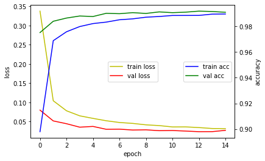

# CNN

본 문서는 TensorFlow Keras 를 사용하여 CNN 을 구현해 보는 문서입니다.<br>
Convolutional Neural Networks 는 현재 이미지 분석에서 가장 성공적으로 쓰이고 있습니다.<br>


(출처: http://ufldl.stanford.edu/tutorial/images/Cnn_layer.png)

## Hyper parameter 


```python
batch_size = 128
num_classes = 10
epochs = 15
```

## 라이브러리 및 함수 설정


```python
import numpy as np
from tensorflow import keras
from tensorflow.keras.models import Sequential
from tensorflow.keras.layers import Dense, Conv2D, MaxPooling2D, Dropout, Flatten
from keras import optimizers

import matplotlib.pyplot as plt
def hist_view(hist):
  print('## training loss and acc ##')
  fig, loss_ax = plt.subplots()
  acc_ax = loss_ax.twinx()

  loss_ax.plot(hist.history['loss'], 'y', label='train loss')
  loss_ax.plot(hist.history['val_loss'], 'r', label='val loss')

  loss_ax.set_xlabel('epoch')
  loss_ax.set_ylabel('loss')
  loss_ax.legend(loc='center')

  acc_ax.plot(hist.history['accuracy'], 'b', label='train acc')
  acc_ax.plot(hist.history['val_accuracy'], 'g', label='val acc')
  acc_ax.set_ylabel('accuracy')
  acc_ax.legend(loc='center right')

  plt.show()
```

## Mnist 
Data 가져오기


```python
from tensorflow.keras.datasets import mnist

(x_train, y_train), (x_test, y_test) = mnist.load_data()
```

## 데이터 세팅


```python
# Scale images to the [0,1] range
x_train = x_train.astype("float32") / 255
x_test = x_test.astype("float32") / 255

# Make images have shape (28,28,1)
x_train = np.expand_dims(x_train, -1)
x_test = np.expand_dims(x_test, -1)

x_train.shape
```


```python
y_train = keras.utils.to_categorical(y_train, num_classes)
y_test = keras.utils.to_categorical(y_test, num_classes)
y_test.shape
```

## CNN 모델 만들기


```python
model = keras.Sequential()

model.add(Conv2D(32, kernel_size=(3, 3), input_shape=(28, 28, 1), activation='relu'))
model.add(MaxPooling2D(pool_size=(2, 2)))
model.add(Conv2D(64, (3, 3), activation='relu'))
model.add(MaxPooling2D(pool_size=(2, 2)))
model.add(Flatten())
model.add(Dropout(0.5))

model.add(Dense(num_classes, activation='softmax'))

model.summary()
```

## 모델 훈련


```python
model.compile(loss='categorical_crossentropy',
              optimizer='adam',
              metrics=['accuracy'])
```


```python
hist = model.fit(x_train, y_train,
          batch_size=batch_size,
          epochs=epochs,
          validation_data=(x_test, y_test))
```

## 확인하기


```python
hist_view(hist)
score = model.evaluate(x_test, y_test, verbose=0)
print('Test loss:', score[0])
print('Test accuracy:', score[1])

```


    

    


    Test loss: 0.027341388165950775
    Test accuracy: 0.9909999966621399

