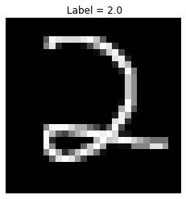
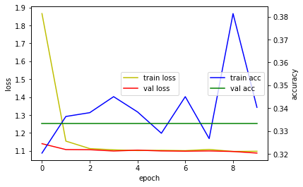

# CNN from File

본 문서는 TensorFlow Keras 를 사용하여 CNN 을 구현해 보는 문서입니다.<br>
Keras 에서 제공하는 것이 아닌 직접 구하거나 만든 자료를 데이터셋으로 사용할 수 있도록 파일을 가져오는 방법을 연습해 봅니다.<BR>

## 라이브러리 및 함수 설정


```python
from __future__ import absolute_import, division, print_function, unicode_literals

import tensorflow as tf

from tensorflow.keras import datasets, layers, models
import numpy as np

import matplotlib.pyplot as plt
def hist_view(hist):
  print('## training loss and acc ##')
  fig, loss_ax = plt.subplots()
  acc_ax = loss_ax.twinx()

  loss_ax.plot(hist.history['loss'], 'y', label='train loss')
  loss_ax.plot(hist.history['val_loss'], 'r', label='val loss')

  loss_ax.set_xlabel('epoch')
  loss_ax.set_ylabel('loss')
  loss_ax.legend(loc='center')

  acc_ax.plot(hist.history['accuracy'], 'b', label='train acc')
  acc_ax.plot(hist.history['val_accuracy'], 'g', label='val acc')
  acc_ax.set_ylabel('accuracy')
  acc_ax.legend(loc='center right')

  plt.show()
```

## Data File 다운로드
파일에 끌어다가 올리거나 구글 드라이브를 마운트 하는 방법으로 대체 가능합니다.


```python
# ![ ! -f  iris0.csv ]&&wget https://github.com/Finfra/AI_Vision/raw/master/data/MNIST_Simple.tar
# !tar -xvf MNIST_Simple.tar
```


```python
!wget https://raw.githubusercontent.com/Finfra/AI_Vision/master/data/MNIST_Simple.tar
!tar xf MNIST_Simple.tar

```

## File 에서 불러오기 위한 세팅


```python
from os import listdir
from os.path import isfile, join
from pylab import *
from numpy import *

def getFolder(thePath,isFile=True):
    return [f for f in listdir(thePath) if isFile == isfile(join(thePath, f)) ]


def getImagesAndLabels(tPath,isGray=True):
    labels=getFolder(tPath,False)
    tImgDic={f:getFolder(join(tPath,f)) for f in labels}
    tImages,tLabels=None,None
    ks=sorted(list(tImgDic.keys()))
    oh=np.identity(len(ks))
    for label in tImgDic.keys():
        for image in tImgDic[label]:
            le=np.array([float(label)],ndmin=1)
            img_color=imread(join(tPath,label,image))
            if isGray:
                img=img_color[:,:,1]
            img1d=img.reshape([1,-1])
            if tImages is None:
                tImages, tLabels =img1d, le
            else:
                tImages,tLabels = np.concatenate((tImages,img1d),axis=0), np.append(tLabels,le ,axis=0)
    return (tImages,tLabels)
```

## File 불러오기


```python
tPath='MNIST_Simple/train/'
train_images,train_labels=getImagesAndLabels(tPath)    
tPath='MNIST_Simple/test/'
test_images,test_labels=getImagesAndLabels(tPath)    

```

데이터 형태 가공


```python

train_images = train_images.reshape((-1, 28, 28, 1))
test_images = test_images.reshape((-1, 28, 28, 1))
train_images, test_images = train_images / 255.0, test_images / 255.0

print("Shape of Train_images = {}".format(train_images.shape))
```

file 확인


```python
import matplotlib.pyplot as plt
plt.gray()
plt.axis("off") 
plt.title(" Label = "+str(train_labels[1000]) ) 
plt.imshow(train_images[1000].reshape(28, 28))

# i0=train_images[0]
# print(np.max(i0),np.min(i0),i0.shape,train_labels.shape,train_labels[0])
```


    

    


## CNN 모델 만들기


```python
model = models.Sequential()
model.add(layers.Conv2D(32, (3, 3), activation='relu', input_shape=(28, 28, 1)))
model.add(layers.MaxPooling2D((2, 2)))
model.add(layers.Conv2D(64, (3, 3), activation='relu'))
model.add(layers.MaxPooling2D((2, 2)))
model.add(layers.Conv2D(64, (3, 3), activation='relu'))
model.add(layers.Flatten())
model.add(layers.Dense(64, activation='relu'))
model.add(layers.Dense(10, activation='softmax'))
model.summary()
```

## 모델 훈련


```python
model.compile(optimizer='adam',
              loss='sparse_categorical_crossentropy',
              metrics=['accuracy'])

hist = model.fit(train_images, train_labels,
          batch_size=128,
          epochs=10,
          validation_data=(test_images, test_labels))
```

## 확인


```python
hist_view(hist)
score = model.evaluate(test_images, test_labels, verbose=0)
print('Test loss:', score[0])
print('Test accuracy:', score[1])

```


    

    


    Test loss: 1.0878390073776245
    Test accuracy: 0.3333333432674408


```python

```
