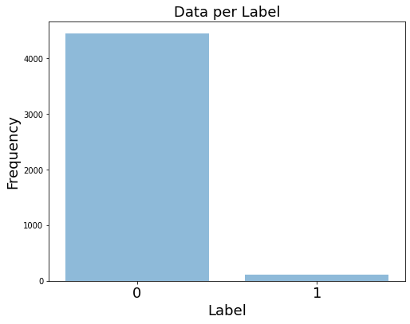
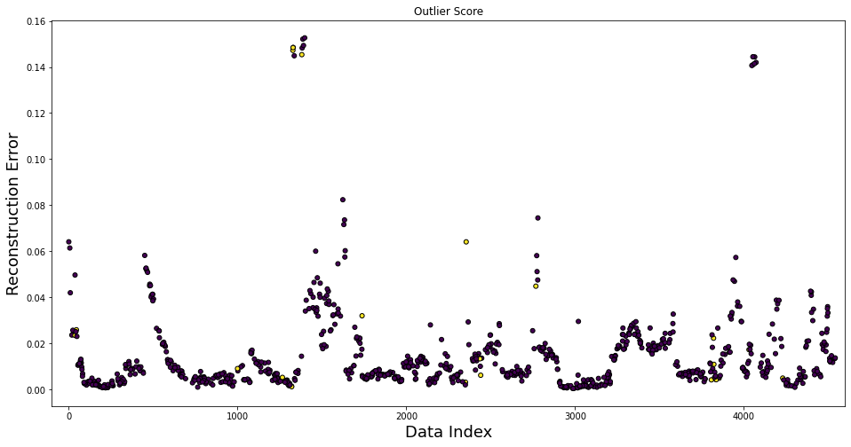
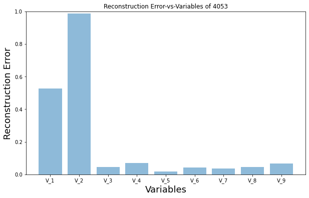
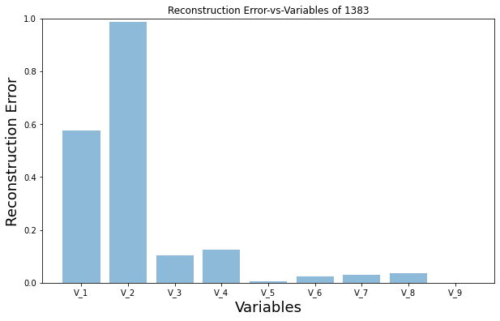
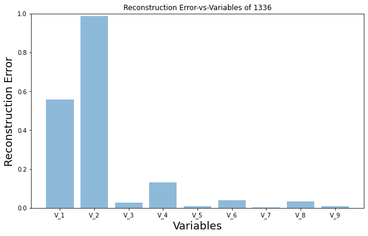
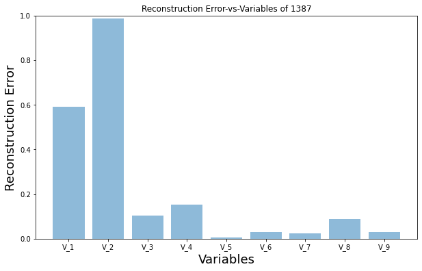

# Neural Networks for Annomaly (Outlier) Detection 
* Source : https://github.com/abelusha/AutoEncoders-for-Anomaly-Detection

<html></html>


Agenda:

- Data Exploration & Preprocessing
- Model Building
- Model Evaluation 
- Model Interpretation


```python
import warnings
warnings.filterwarnings("ignore")
!pip install ann_visualizer
```


```python
import numpy
import pandas
import matplotlib
import seaborn
import tensorflow
from  tensorflow import keras
```


```python
print('Numpy version      :' , numpy.__version__)
print('Pandas version     :' ,pandas.__version__)
print('matplotlib version :' ,matplotlib.__version__)
print('seaborn version    :' , seaborn.__version__)
print('tensorflow version :' , tensorflow.__version__)
print('keras version      :' , keras.__version__)
```


```python
import numpy as np
import pandas as pd
pd.set_option('display.max_columns', None)
pd.set_option('display.max_row', None)
import matplotlib.pyplot as plt
plt.rcdefaults()
from pylab import rcParams
import seaborn as sns
%matplotlib inline

####### Deep learning libraries
import tensorflow as tf
from tensorflow import keras
from tensorflow.keras.models import Model, load_model
from tensorflow.keras.layers import Input, Dense
from tensorflow.keras.callbacks import ModelCheckpoint, TensorBoard
from tensorflow.keras import regularizers
from ann_visualizer.visualize import ann_viz
# 
from sklearn.preprocessing import  StandardScaler, MinMaxScaler
from sklearn.model_selection import train_test_split

from sklearn.metrics import (confusion_matrix, classification_report, accuracy_score, roc_auc_score, auc,
                             precision_score, recall_score, roc_curve, precision_recall_curve,
                             precision_recall_fscore_support, f1_score,
                             precision_recall_fscore_support)
#
from IPython.display import display, Math, Latex

```

# Load Data


```python
![ ! -f JADS_CarrerDay_Data.csv ]&&wget https://raw.githubusercontent.com/Finfra/AI_Vision/master/data/JADS_CarrerDay_Data.csv
df = pd.read_csv('JADS_CarrerDay_Data.csv',index_col=0)
```


```python
df.index
```


```python
df.reset_index(inplace=True, drop= True)
```


```python
df.index
```


```python
df.head()
```


```python
df.shape
```


```python
df.Label.value_counts()
```


```python
df.Label.value_counts(normalize=True)*100
```

# Highly Imbalanced Data


```python
df.columns
```


```python
numerical_cols = ['V_1', 'V_2', 'V_3', 'V_4', 'V_5', 'V_6', 'V_7', 'V_8', 'V_9']
```


```python
df.Label.unique()
```


```python
labels = df['Label'].astype(int)
labels[labels != 0] = 1
```


```python
len(labels[labels !=0])
```

# Data Exploration


```python
df.Label.value_counts().tolist()
```


```python
plt.figure(figsize=(8,6))
objects = tuple(['0', '1']) 
y_pos = np.arange(len(objects))
x   = np.arange(len(objects))
y   = df.Label.value_counts().tolist()
#plt.ylim([0, 1.2])
plt.bar(x, y, align='center', alpha=0.5)
plt.xticks(y_pos, objects,fontsize=18)
plt.xlabel('Label', fontsize=18)
plt.ylabel('Frequency', fontsize=18)
plt.title('Data per Label',fontsize=18)

```


    

    


# Data Preprocessing

- Let's leverage the fact we know the labels of our data


```python
RANDOM_SEED = 101

X_train, X_test = train_test_split(df, test_size=0.2, random_state = RANDOM_SEED)

X_train = X_train[X_train['Label'] == 0]
X_train = X_train.drop(['Label'], axis=1)
y_test  = X_test['Label']
X_test  = X_test.drop(['Label'], axis=1)
X_train = X_train.values
X_test  = X_test.values
print('Training data size   :', X_train.shape)
print('Validation data size :', X_test.shape)
```

# Data Scaling


```python
scaler = MinMaxScaler()
#scaler = StandardScaler()
X_train_scaled = scaler.fit_transform(X_train)
X_test_scaled  = scaler.transform(X_test)
```

# Modeling

# AutoEncoders

- Feed Forward Neural Network model for unsupervised tasks (No Lables)
- Model the identity function f(x) ≈  x (It encodes itself)
- Simple to undersatnd!
- Compress data and learn some features 

Ref:
https://probablydance.com/2016/04/30/neural-networks-are-impressively-good-at-compression/


# Reconstruction error


min $$L(x, x')  ≈ ||x - x'||^{2}$$


```python
input_dim = X_train.shape[1]
encoding_dim = 6

input_layer = Input(shape=(input_dim, ))
encoder = Dense(encoding_dim, activation="tanh",activity_regularizer=regularizers.l1(10e-5))(input_layer)
encoder = Dense(int(encoding_dim / 2), activation="tanh")(encoder)
encoder = Dense(int(encoding_dim / 4), activation="tanh")(encoder)
decoder = Dense(int(encoding_dim/ 2), activation='tanh')(encoder)
decoder = Dense(int(encoding_dim), activation='tanh')(decoder)
decoder = Dense(input_dim, activation='tanh')(decoder)
autoencoder = Model(inputs=input_layer, outputs=decoder)
autoencoder.summary()
```


```python
nb_epoch = 100
batch_size = 50
autoencoder.compile(optimizer='adam', loss='mse' )

history = autoencoder.fit(X_train_scaled, X_train_scaled,
                        epochs=nb_epoch,
                        batch_size=batch_size,
                        shuffle=True,
                        validation_split=0.1,
                        verbose=0
                        ).history

# validation_data=(X_test_scaled, X_test_scaled)
```


```python
plt.figure(figsize=(12,8))
plt.plot(history['loss'])
plt.plot(history['val_loss'])
plt.ylabel('Loss',fontsize= 18)
plt.xlabel('Epoch',fontsize= 18)
plt.legend(['train', 'test'], loc='upper right', fontsize= 18);
```

# Predictions & Reconstruction Error


```python
predictions = autoencoder.predict(X_test_scaled)

mse = np.mean(np.power(X_test_scaled - predictions, 2), axis=1)
df_error = pd.DataFrame({'reconstruction_error': mse, 'Label': y_test}, index=y_test.index)
df_error.describe()

```


```python
plt.figure(figsize=(16,8))
plt.scatter(df_error.index, df_error['reconstruction_error'], c=df_error['Label'], edgecolor='black', s=25)
plt.xlabel('Data Index', fontsize = 18)
plt.ylabel('Reconstruction Error', fontsize = 18)
plt.xlim((-100,4600))
plt.title("Outlier Score")

```


    

    


# Model Interpretability

- Major problem of neural network models is ...?


```python
df_error.sort_values(ascending=False, by = 'reconstruction_error').head(10)
```


```python
df_error.describe()
```


```python
outliers = df_error.index[df_error.reconstruction_error > 0.1].tolist()
```


```python
data_n = pd.DataFrame(X_test_scaled, index= y_test.index, columns=numerical_cols)
```


```python
data_n.head()
```


```python
def compute_error_per_dim(point):
    
    initial_pt = np.array(data_n.loc[point,:]).reshape(1,9)
    reconstrcuted_pt = autoencoder.predict(initial_pt)
    
    return abs(np.array(initial_pt  - reconstrcuted_pt)[0])
```


```python
for i in outliers[:5]:
    
    plt.figure(figsize=(10,6))
    objects = tuple(numerical_cols) 
    y_pos   = np.arange(len(objects))
    x       = np.arange(len(objects))
    y       = compute_error_per_dim(i).tolist()
    plt.ylim([0, 1.0])
    plt.bar(x, y, align='center', alpha=0.5)
    plt.xticks(y_pos, objects)
    plt.xlabel('Variables',fontsize=18)
    plt.ylabel('Reconstruction Error', fontsize=18)
    plt.title('Reconstruction Error-vs-Variables of {}'.format(i))
 
```


    

    


    

    


    

    


    

    


# Conclusions

- **There is a patten for V_1 & V_2 in contributing mainly to the reconstruction error!**
- **AEs can be good choice to reduce dimensions in high dimensional data!**
- **AEs are good for outlier detections in complex data!**


```python

```
