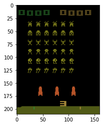
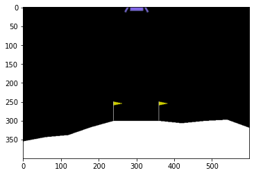
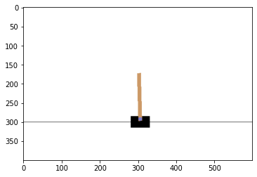

> This notebook presents the preambles needed for working with Gym at Google CoLab and Gym Environments. 

> A [second python notebook](https://colab.research.google.com/drive/1tug_bpg8RwrFOI8C6Ed-zo0OgD3yfnWy) shows how to solve some tasks with random action, assigned deterministic action, or heuristic action and how to render the process of tasks to video. 

> A [third python notebook](https://colab.research.google.com/drive/1C5iArMcVaiIwGatAj2utZAMHVtEmLLfw) explores more complex policy using existing functions. 

Later, I will show how to craft your own RL algorithms from scratch in a seperate installment of python notebooks. 

# CoLab Preambles

Most of the requirements of python packages are already fulfilled on CoLab. To run Gym, you have to install prerequisites like xvbf,opengl & other python-dev packages using the following codes.

[](To be done next time: )
[](https://becominghuman.ai/lets-build-an-atari-ai-part-1-dqn-df57e8ff3b26)


```
!pip install gym
!apt-get install python-opengl -y
!apt install xvfb -y
```


```
!pip install gym[atari]
```

For rendering environment, you can use pyvirtualdisplay. So fulfill that 


```
!pip install pyvirtualdisplay
!pip install piglet
```

To activate virtual display we need to run a script once for training an agent, as follows:


```
from pyvirtualdisplay import Display
display = Display(visible=0, size=(1400, 900))
display.start()
```


```
# This code creates a virtual display to draw game images on. 
# If you are running locally, just ignore it
import os
if type(os.environ.get("DISPLAY")) is not str or len(os.environ.get("DISPLAY"))==0:
    !bash ../xvfb start
    %env DISPLAY=:1
```


```
import gym
from gym import logger as gymlogger
from gym.wrappers import Monitor
gymlogger.set_level(40) # error only
import tensorflow as tf
import numpy as np
import random
import matplotlib
import matplotlib.pyplot as plt
%matplotlib inline
import math
import glob
import io
import base64
from IPython.display import HTML

from IPython import display as ipythondisplay
```


```
"""
Utility functions to enable video recording of gym environment and displaying it
To enable video, just do "env = wrap_env(env)""
"""

def show_video():
  mp4list = glob.glob('video/*.mp4')
  if len(mp4list) > 0:
    mp4 = mp4list[0]
    video = io.open(mp4, 'r+b').read()
    encoded = base64.b64encode(video)
    ipythondisplay.display(HTML(data='''<video alt="test" autoplay 
                loop controls style="height: 400px;">
                <source src="data:video/mp4;base64,{0}" type="video/mp4" />
             </video>'''.format(encoded.decode('ascii'))))
  else: 
    print("Could not find video")
    

def wrap_env(env):
  env = Monitor(env, './video', force=True)
  return env
```

# OpenAI Gym Available Environment

Gym comes with a diverse suite of environments that range from easy to difficult and involve many different kinds of data. View the [full list of environments](https://gym.openai.com/envs) to get the birds-eye view.

- [Classic control](https://gym.openai.com/envs#classic_control) and [toy text](https://gym.openai.com/envs#toy_text): complete small-scale tasks, mostly from the RL literature. They’re here to get you started.

- [Algorithmic](https://gym.openai.com/envs#algorithmic): perform computations such as adding multi-digit numbers and reversing sequences. One might object that these tasks are easy for a computer. The challenge is to learn these algorithms purely from examples. These tasks have the nice property that it’s easy to vary the difficulty by varying the sequence length.

- [Atari](https://gym.openai.com/envs#atari): play classic Atari games. 

- [2D and 3D robots](https://gym.openai.com/envs#mujoco): control a robot in simulation. These tasks use the MuJoCo physics engine, which was designed for fast and accurate robot simulation. 


##  List the Environments Available in your Installation

gym’s main purpose is to provide a large collection of environments that expose a common interface and are versioned to allow for comparisons. 


```
from gym import envs
print(envs.registry.all())
```

## Add your own environments


```
# # to be completed
# gym.make()
# register()
```

## Algorithmic

These are a variety of algorithmic tasks, such as learning to copy a sequence.


```
env = gym.make('Copy-v0')
env.reset()
#plt.imshow(env.render())
env.render()
```

## Atari

The Atari environments are a variety of Atari video games. Gym is already installed but not with atari game environments, to get that:


```
!pip install gym[atari]
```


```
# Atari Environment
env = gym.make('SpaceInvaders-v0')
env.reset()
plt.imshow(env.render('rgb_array'))
```


    

    


## Box2d

Box2d is a 2D physics engine. You can install it via  and then get started as follow:


```
!pip install gym[box2d]
```


```
# Box2d Environment
env = gym.make('LunarLander-v2')
env.reset()
plt.imshow(env.render('rgb_array'))
#env.render()
```


    

    


## Classic control
These are a variety of classic control tasks, which would appear in a typical reinforcement learning textbook. If you didn't do the full install, you will need to run the following code to enable rendering. 


```
!pip install gym[classic_control]
```


```
env = gym.make('CartPole-v0')
env.reset()
plt.imshow(env.render('rgb_array'))
#env.render()
```


    

    


```

```
