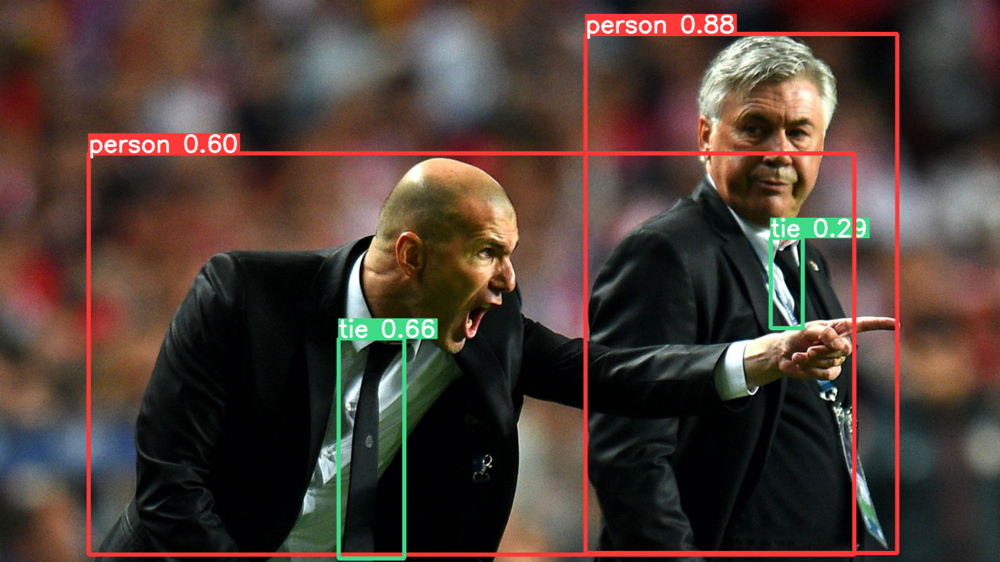
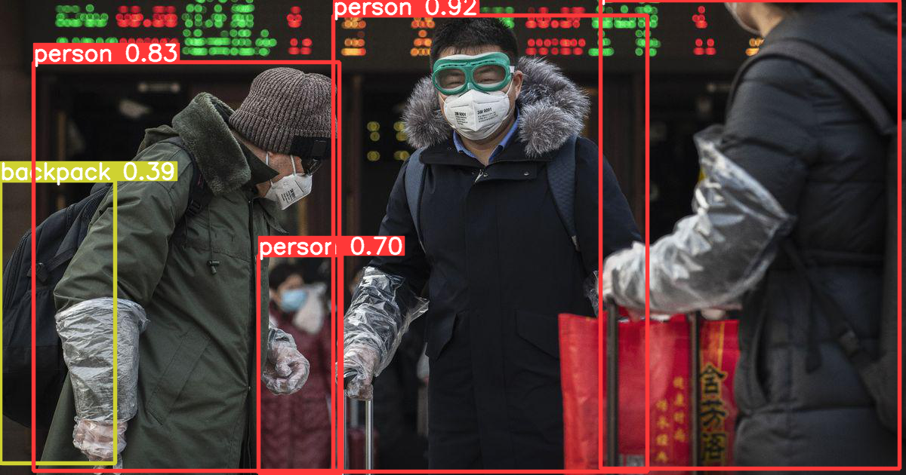

# Setting


```python
import torch
```


```python
## Google Drive Mount

from google.colab import drive
isMount=!df |grep /content/drive
if len(isMount) < 1 : drive.mount('/content/drive', force_remount=False)

```


```python
!pip uninstall -y imgaug

```


```python
wPath='/content/drive/MyDrive/imgAugWithSR_prj/ImgAugWithSR/yolov5'
```


```python
%cd {wPath}
!pip install -r requirements.txt


```

# Execute Example


```python
# PyTorch Hub
import torch

# Model
model = torch.hub.load('ultralytics/yolov5', 'yolov5s')

# Images
dir = 'https://ultralytics.com/images/'
imgs = [dir + f for f in ('zidane.jpg', 'bus.jpg')]  # batch of images

# Inference
results = model(imgs)
results.print()  # or .show(), .save()
results.show()
```

## Local image test


```python
%cd /content
```


```python
!url='https://ultralytics.com/images/zidane.jpg';[ ! -f ${url##*/} ] && wget $url
```


```python
imgs = ['/content/zidane.jpg']  # batch of images

# Inference
results = model(imgs)
results.print()  # or .show(), .save()
results.show()
```


    

    


## Test External Weight


```python
dPath='/content/drive/MyDrive/imgAugWithSR_prj/data/yolov5/yolov5_mask'
mPath='/content/drive/MyDrive/imgAugWithSR_prj/data/yolov5/mask_yolov5s_results/weights/best.pt'
```


```python
torch.load(mPath)
```


```python
%cd /content
imgs = ['/content/drive/MyDrive/imgAugWithSR_prj/data/yolov5/mask_data/test/images/0_Concern-In-China-As-Mystery-Virus-Spreads_jpg.rf.5633f5fe7a9b926101b7fc16615dfb6a.jpg']  # batch of images

# Inference
results = model(imgs)
results.print()  # or .show(), .save()
results.show()
```

    image 1/1: 630x1200 4 persons, 1 backpack
    Speed: 37.4ms pre-process, 261.0ms inference, 1.2ms NMS per image at shape (1, 3, 352, 640)


    

    


```python

```
