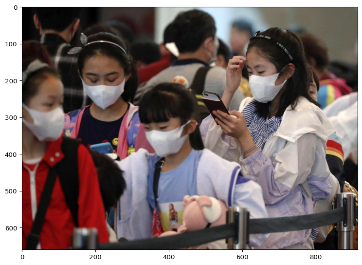

# Train

## 구글 드라이브 마운트


```python
from google.colab import drive
isMount=!df |grep /content/drive
if len(isMount) < 1 : drive.mount('/content/drive', force_remount=False)

```

## 데이터 위치지정


```python
# Data file 
url = 'https://public.roboflow.com/ds/eL4QUdkpSR?key=0ikL5WLM1w'

# Data file Path
dPath=dPath='/content/drive/MyDrive/_code/ObjectDetection/data/yolov5_mask'  

# Working folder Path
wPath='/content/drive/MyDrive/_code/ObjectDetection/yolov5'

```

## Yolov5 환경 설정

- yolo 가 깔린 폴더로 이동


```python
%cd {wPath}
```

- requirements.txt 파일로 필요라이브러리 설치


```python
!pip install -r requirements.txt
```

## 데이터셋 다운로드

- dPath 생성


```python
!mkdir {dPath}
```

- roboflow 데이터셋 다운로드


```python
%cd {dPath}
!curl -L "{url}" > roboflow.zip; unzip roboflow.zip; rm roboflow.zip 
```

## Train 실행

- yolov5 폴더 이동


```python
%cd {wPath}
```

- train 파일을 임포트하여 훈련


```python
import train
datapath = dPath+'/data.yaml'
train.run(data=datapath, imgsz=416, batch=16, epochs=50, weights='models/yolov5s.pt', name="masks")
```

    github: ⚠️ YOLOv5 is out of date by 13 commits. Use `git pull` or `git clone https://github.com/ultralytics/yolov5` to update.
    requirements: PyYAML>=5.3.1 not found and is required by YOLOv5, attempting auto-update...


    YOLOv5 🚀 v6.0-102-gf17c86b torch 1.10.0+cu111 CUDA:0 (Tesla K80, 11441MiB)
    
    hyperparameters: lr0=0.01, lrf=0.1, momentum=0.937, weight_decay=0.0005, warmup_epochs=3.0, warmup_momentum=0.8, warmup_bias_lr=0.1, box=0.05, cls=0.5, cls_pw=1.0, obj=1.0, obj_pw=1.0, iou_t=0.2, anchor_t=4.0, fl_gamma=0.0, hsv_h=0.015, hsv_s=0.7, hsv_v=0.4, degrees=0.0, translate=0.1, scale=0.5, shear=0.0, perspective=0.0, flipud=0.0, fliplr=0.5, mosaic=1.0, mixup=0.0, copy_paste=0.0


    Requirement already satisfied: PyYAML>=5.3.1 in /usr/local/lib/python3.7/dist-packages (6.0)
    
    requirements: 1 package updated per /content/drive/MyDrive/_code/ObjectDetection/yolov5/requirements.txt
    requirements: ⚠️ Restart runtime or rerun command for updates to take effect
    
    Weights & Biases: run 'pip install wandb' to automatically track and visualize YOLOv5 🚀 runs (RECOMMENDED)


    TensorBoard: Start with 'tensorboard --logdir runs/train', view at http://localhost:6006/
    Overriding model.yaml nc=80 with nc=2
    
                     from  n    params  module                                  arguments                     
      0                -1  1      3520  models.common.Conv                      [3, 32, 6, 2, 2]              
      1                -1  1     18560  models.common.Conv                      [32, 64, 3, 2]                
      2                -1  1     18816  models.common.C3                        [64, 64, 1]                   
      3                -1  1     73984  models.common.Conv                      [64, 128, 3, 2]               
      4                -1  2    115712  models.common.C3                        [128, 128, 2]                 
      5                -1  1    295424  models.common.Conv                      [128, 256, 3, 2]              
      6                -1  3    625152  models.common.C3                        [256, 256, 3]                 
      7                -1  1   1180672  models.common.Conv                      [256, 512, 3, 2]              
      8                -1  1   1182720  models.common.C3                        [512, 512, 1]                 
      9                -1  1    656896  models.common.SPPF                      [512, 512, 5]                 
     10                -1  1    131584  models.common.Conv                      [512, 256, 1, 1]              
     11                -1  1         0  torch.nn.modules.upsampling.Upsample    [None, 2, 'nearest']          
     12           [-1, 6]  1         0  models.common.Concat                    [1]                           
     13                -1  1    361984  models.common.C3                        [512, 256, 1, False]          
     14                -1  1     33024  models.common.Conv                      [256, 128, 1, 1]              
     15                -1  1         0  torch.nn.modules.upsampling.Upsample    [None, 2, 'nearest']          
     16           [-1, 4]  1         0  models.common.Concat                    [1]                           
     17                -1  1     90880  models.common.C3                        [256, 128, 1, False]          
     18                -1  1    147712  models.common.Conv                      [128, 128, 3, 2]              
     19          [-1, 14]  1         0  models.common.Concat                    [1]                           
     20                -1  1    296448  models.common.C3                        [256, 256, 1, False]          
     21                -1  1    590336  models.common.Conv                      [256, 256, 3, 2]              
     22          [-1, 10]  1         0  models.common.Concat                    [1]                           
     23                -1  1   1182720  models.common.C3                        [512, 512, 1, False]          
     24      [17, 20, 23]  1     18879  models.yolo.Detect                      [2, [[10, 13, 16, 30, 33, 23], [30, 61, 62, 45, 59, 119], [116, 90, 156, 198, 373, 326]], [128, 256, 512]]
    Model Summary: 270 layers, 7025023 parameters, 7025023 gradients, 15.9 GFLOPs
    
    Transferred 343/349 items from models/yolov5s.pt
    Scaled weight_decay = 0.0005
    optimizer: SGD with parameter groups 57 weight, 60 weight (no decay), 60 bias
    albumentations: version 1.0.3 required by YOLOv5, but version 0.1.12 is currently installed
    train: Scanning '/content/drive/MyDrive/_code/ObjectDetection/data/yolov5_mask/test/labels.cache' images and labels... 149 found, 0 missing, 0 empty, 0 corrupted: 100%|██████████| 149/149 [00:00<?, ?it/s]
    val: Scanning '/content/drive/MyDrive/_code/ObjectDetection/data/yolov5_mask/test/labels.cache' images and labels... 149 found, 0 missing, 0 empty, 0 corrupted: 100%|██████████| 149/149 [00:00<?, ?it/s]
    Plotting labels to runs/train/masks/labels.jpg... 
    
    AutoAnchor: 5.69 anchors/target, 0.999 Best Possible Recall (BPR). Current anchors are a good fit to dataset ✅
    Image sizes 416 train, 416 val
    Using 2 dataloader workers
    Logging results to runs/train/masks
    Starting training for 50 epochs...
    
         Epoch   gpu_mem       box       obj       cls    labels  img_size
          0/49     1.95G    0.1207   0.05184   0.02905        69       416: 100%|███
                   Class     Images     Labels          P          R     mAP@.5 mAP@
                     all        149        954    0.00329     0.0313    0.00155   0.000309
    
         Epoch   gpu_mem       box       obj       cls    labels  img_size
          1/49     1.95G    0.1172   0.05162    0.0276        46       416: 100%|███
                   Class     Images     Labels          P          R     mAP@.5 mAP@
                     all        149        954    0.00348     0.0375    0.00186   0.000384
    
         Epoch   gpu_mem       box       obj       cls    labels  img_size
          2/49     1.95G    0.1129   0.05858   0.02601        54       416: 100%|███
                   Class     Images     Labels          P          R     mAP@.5 mAP@
                     all        149        954    0.00421      0.172    0.00257   0.000555
    
         Epoch   gpu_mem       box       obj       cls    labels  img_size
          3/49     1.95G     0.109   0.06585   0.02431        74       416: 100%|███
                   Class     Images     Labels          P          R     mAP@.5 mAP@
                     all        149        954    0.00609      0.106    0.00374   0.000792
    
         Epoch   gpu_mem       box       obj       cls    labels  img_size
          4/49     1.95G    0.1042   0.06638   0.02407        41       416: 100%|███
                   Class     Images     Labels          P          R     mAP@.5 mAP@
                     all        149        954     0.0135     0.0698    0.00708     0.0014
    
         Epoch   gpu_mem       box       obj       cls    labels  img_size
          5/49     1.95G   0.09941   0.06376   0.02124       151       416: 100%|███
                   Class     Images     Labels          P          R     mAP@.5 mAP@
                     all        149        954     0.0457     0.0614     0.0203    0.00395
    
         Epoch   gpu_mem       box       obj       cls    labels  img_size
          6/49     1.95G   0.09726   0.06517   0.01988        20       416: 100%|███
                   Class     Images     Labels          P          R     mAP@.5 mAP@
                     all        149        954     0.0783      0.167     0.0542     0.0116
    
         Epoch   gpu_mem       box       obj       cls    labels  img_size
          7/49     1.95G   0.09481    0.0734   0.01911        94       416: 100%|███
                   Class     Images     Labels          P          R     mAP@.5 mAP@
                     all        149        954      0.103       0.27     0.0873     0.0201
    
         Epoch   gpu_mem       box       obj       cls    labels  img_size
          8/49     1.95G   0.08708   0.06947   0.01862        23       416: 100%|███
                   Class     Images     Labels          P          R     mAP@.5 mAP@
                     all        149        954      0.201      0.208      0.147     0.0329
    
         Epoch   gpu_mem       box       obj       cls    labels  img_size
          9/49     1.95G   0.08365   0.06227   0.01714        65       416: 100%|███
                   Class     Images     Labels          P          R     mAP@.5 mAP@
                     all        149        954      0.226      0.211       0.19     0.0475
    
         Epoch   gpu_mem       box       obj       cls    labels  img_size
         10/49     1.95G   0.07939   0.06211   0.01673        40       416: 100%|███
                   Class     Images     Labels          P          R     mAP@.5 mAP@
                     all        149        954      0.711      0.262      0.223     0.0606
    
         Epoch   gpu_mem       box       obj       cls    labels  img_size
         11/49     1.95G   0.07577    0.0636   0.01706        43       416: 100%|███
                   Class     Images     Labels          P          R     mAP@.5 mAP@
                     all        149        954      0.719      0.244      0.213     0.0569
    
         Epoch   gpu_mem       box       obj       cls    labels  img_size
         12/49     1.95G    0.0737   0.05932   0.01483        29       416: 100%|███
                   Class     Images     Labels          P          R     mAP@.5 mAP@
                     all        149        954      0.749      0.263      0.253     0.0702
    
         Epoch   gpu_mem       box       obj       cls    labels  img_size
         13/49     1.95G   0.06766   0.05672   0.01563        79       416: 100%|███
                   Class     Images     Labels          P          R     mAP@.5 mAP@
                     all        149        954      0.741      0.272      0.271     0.0886
    
         Epoch   gpu_mem       box       obj       cls    labels  img_size
         14/49     1.95G   0.06448   0.05312   0.01593        60       416: 100%|███
                   Class     Images     Labels          P          R     mAP@.5 mAP@
                     all        149        954      0.759      0.246      0.262     0.0724
    
         Epoch   gpu_mem       box       obj       cls    labels  img_size
         15/49     1.95G    0.0646   0.05933   0.01683        66       416: 100%|███
                   Class     Images     Labels          P          R     mAP@.5 mAP@
                     all        149        954      0.796      0.277      0.322      0.108
    
         Epoch   gpu_mem       box       obj       cls    labels  img_size
         16/49     1.95G   0.06264    0.0523   0.01649        47       416: 100%|███
                   Class     Images     Labels          P          R     mAP@.5 mAP@
                     all        149        954      0.742      0.232      0.251      0.065
    
         Epoch   gpu_mem       box       obj       cls    labels  img_size
         17/49     1.95G   0.07051   0.05759   0.01522        68       416: 100%|███
                   Class     Images     Labels          P          R     mAP@.5 mAP@
                     all        149        954      0.712      0.276      0.241     0.0728
    
         Epoch   gpu_mem       box       obj       cls    labels  img_size
         18/49     1.95G   0.06761   0.05355   0.01476        69       416: 100%|███
                   Class     Images     Labels          P          R     mAP@.5 mAP@
                     all        149        954      0.735      0.279      0.268     0.0711
    
         Epoch   gpu_mem       box       obj       cls    labels  img_size
         19/49     1.95G    0.0679   0.05226   0.01503        55       416: 100%|███
                   Class     Images     Labels          P          R     mAP@.5 mAP@
                     all        149        954      0.779      0.307      0.321        0.1
    
         Epoch   gpu_mem       box       obj       cls    labels  img_size
         20/49     1.95G   0.06583   0.05307   0.01415        76       416: 100%|███
                   Class     Images     Labels          P          R     mAP@.5 mAP@
                     all        149        954      0.778      0.322      0.336      0.121
    
         Epoch   gpu_mem       box       obj       cls    labels  img_size
         21/49     1.95G   0.06416   0.05054   0.01478        46       416: 100%|███
                   Class     Images     Labels          P          R     mAP@.5 mAP@
                     all        149        954      0.747       0.31      0.299     0.0864
    
         Epoch   gpu_mem       box       obj       cls    labels  img_size
         22/49     1.95G   0.06296   0.05175    0.0152        51       416: 100%|███
                   Class     Images     Labels          P          R     mAP@.5 mAP@
                     all        149        954      0.786      0.322      0.348      0.138
    
         Epoch   gpu_mem       box       obj       cls    labels  img_size
         23/49     1.95G   0.06073    0.0484   0.01323        64       416: 100%|███
                   Class     Images     Labels          P          R     mAP@.5 mAP@
                     all        149        954      0.794       0.27      0.312      0.116
    
         Epoch   gpu_mem       box       obj       cls    labels  img_size
         24/49     1.95G   0.06023   0.05368   0.01592        49       416: 100%|███
                   Class     Images     Labels          P          R     mAP@.5 mAP@
                     all        149        954      0.792      0.292      0.341      0.136
    
         Epoch   gpu_mem       box       obj       cls    labels  img_size
         25/49     1.95G   0.06167   0.05232    0.0156        64       416: 100%|███
                   Class     Images     Labels          P          R     mAP@.5 mAP@
                     all        149        954      0.819      0.344      0.388      0.181
    
         Epoch   gpu_mem       box       obj       cls    labels  img_size
         26/49     1.95G   0.05446   0.04328   0.01424        35       416: 100%|███
                   Class     Images     Labels          P          R     mAP@.5 mAP@
                     all        149        954      0.799      0.313      0.361      0.144
    
         Epoch   gpu_mem       box       obj       cls    labels  img_size
         27/49     1.95G   0.05664   0.04828   0.01541        37       416: 100%|███
                   Class     Images     Labels          P          R     mAP@.5 mAP@
                     all        149        954      0.787       0.36      0.359      0.149
    
         Epoch   gpu_mem       box       obj       cls    labels  img_size
         28/49     1.95G   0.05518   0.04671   0.01377        52       416: 100%|███
                   Class     Images     Labels          P          R     mAP@.5 mAP@
                     all        149        954      0.792      0.311      0.343      0.124
    
         Epoch   gpu_mem       box       obj       cls    labels  img_size
         29/49     1.95G   0.05809   0.05208   0.01366        81       416: 100%|███
                   Class     Images     Labels          P          R     mAP@.5 mAP@
                     all        149        954       0.78      0.364      0.371       0.15
    
         Epoch   gpu_mem       box       obj       cls    labels  img_size
         30/49     1.95G   0.05322   0.04698   0.01661        30       416: 100%|███
                   Class     Images     Labels          P          R     mAP@.5 mAP@
                     all        149        954        0.8      0.359      0.379      0.139
    
         Epoch   gpu_mem       box       obj       cls    labels  img_size
         31/49     1.95G   0.05693    0.0423   0.01461        34       416: 100%|███
                   Class     Images     Labels          P          R     mAP@.5 mAP@
                     all        149        954      0.848      0.389      0.433       0.19
    
         Epoch   gpu_mem       box       obj       cls    labels  img_size
         32/49     1.95G    0.0524   0.05191   0.01449        51       416: 100%|███
                   Class     Images     Labels          P          R     mAP@.5 mAP@
                     all        149        954      0.853      0.382      0.443      0.219
    
         Epoch   gpu_mem       box       obj       cls    labels  img_size
         33/49     1.95G   0.05192   0.05152   0.01526        58       416: 100%|███
                   Class     Images     Labels          P          R     mAP@.5 mAP@
                     all        149        954      0.879      0.389       0.46      0.227
    
         Epoch   gpu_mem       box       obj       cls    labels  img_size
         34/49     1.95G   0.04864   0.04599    0.0169        26       416: 100%|███
                   Class     Images     Labels          P          R     mAP@.5 mAP@
                     all        149        954      0.859      0.387      0.451      0.211
    
         Epoch   gpu_mem       box       obj       cls    labels  img_size
         35/49     1.95G   0.04776   0.04362   0.01418        45       416: 100%|███
                   Class     Images     Labels          P          R     mAP@.5 mAP@
                     all        149        954      0.892      0.378      0.473      0.238
    
         Epoch   gpu_mem       box       obj       cls    labels  img_size
         36/49     1.95G   0.04674   0.04473   0.01363        49       416: 100%|███
                   Class     Images     Labels          P          R     mAP@.5 mAP@
                     all        149        954      0.864      0.373      0.448      0.221
    
         Epoch   gpu_mem       box       obj       cls    labels  img_size
         37/49     1.95G   0.04762   0.05044   0.01433        65       416: 100%|███
                   Class     Images     Labels          P          R     mAP@.5 mAP@
                     all        149        954      0.848      0.388      0.447       0.21
    
         Epoch   gpu_mem       box       obj       cls    labels  img_size
         38/49     1.95G   0.04655   0.04882   0.01651        54       416: 100%|███
                   Class     Images     Labels          P          R     mAP@.5 mAP@
                     all        149        954      0.926      0.377      0.492      0.269
    
         Epoch   gpu_mem       box       obj       cls    labels  img_size
         39/49     1.95G   0.04707   0.05206   0.01553        53       416: 100%|███
                   Class     Images     Labels          P          R     mAP@.5 mAP@
                     all        149        954       0.92      0.389      0.496      0.244
    
         Epoch   gpu_mem       box       obj       cls    labels  img_size
         40/49     1.95G   0.04757   0.04557   0.01501        60       416: 100%|███
                   Class     Images     Labels          P          R     mAP@.5 mAP@
                     all        149        954      0.879      0.401      0.473      0.234
    
         Epoch   gpu_mem       box       obj       cls    labels  img_size
         41/49     1.95G    0.0461   0.04668   0.01481        57       416: 100%|███
                   Class     Images     Labels          P          R     mAP@.5 mAP@
                     all        149        954      0.921      0.393        0.5      0.274
    
         Epoch   gpu_mem       box       obj       cls    labels  img_size
         42/49     1.95G   0.04181   0.04478   0.01466        51       416: 100%|███
                   Class     Images     Labels          P          R     mAP@.5 mAP@
                     all        149        954      0.283      0.824      0.506      0.284
    
         Epoch   gpu_mem       box       obj       cls    labels  img_size
         43/49     1.95G   0.04229    0.0461   0.01364        63       416: 100%|███
                   Class     Images     Labels          P          R     mAP@.5 mAP@
                     all        149        954      0.294      0.798      0.512      0.286
    
         Epoch   gpu_mem       box       obj       cls    labels  img_size
         44/49     1.95G   0.04192   0.04091    0.0161        30       416: 100%|███
                   Class     Images     Labels          P          R     mAP@.5 mAP@
                     all        149        954      0.286      0.812      0.507      0.285
    
         Epoch   gpu_mem       box       obj       cls    labels  img_size
         45/49     1.95G   0.04244   0.04171   0.01429        35       416: 100%|███
                   Class     Images     Labels          P          R     mAP@.5 mAP@
                     all        149        954      0.285      0.813      0.508      0.284
    
         Epoch   gpu_mem       box       obj       cls    labels  img_size
         46/49     1.95G   0.04094   0.04303   0.01514        27       416: 100%|███
                   Class     Images     Labels          P          R     mAP@.5 mAP@
                     all        149        954      0.291       0.82      0.513      0.294
    
         Epoch   gpu_mem       box       obj       cls    labels  img_size
         47/49     1.95G   0.04145   0.04437   0.01458        36       416: 100%|███
                   Class     Images     Labels          P          R     mAP@.5 mAP@
                     all        149        954      0.302      0.752      0.513      0.291
    
         Epoch   gpu_mem       box       obj       cls    labels  img_size
         48/49     1.95G   0.04193   0.04855   0.01487        88       416: 100%|███
                   Class     Images     Labels          P          R     mAP@.5 mAP@
                     all        149        954      0.298      0.812      0.519      0.297
    
         Epoch   gpu_mem       box       obj       cls    labels  img_size
         49/49     1.95G   0.04149   0.04669   0.01596        40       416: 100%|███
                   Class     Images     Labels          P          R     mAP@.5 mAP@
                     all        149        954      0.302      0.832       0.52      0.301
    
    50 epochs completed in 0.242 hours.


    Optimizer stripped from runs/train/masks/weights/last.pt, 14.3MB


    
    Validating runs/train/masks/weights/best.pt...


    Optimizer stripped from runs/train/masks/weights/best.pt, 14.3MB


    Fusing layers... 
    Model Summary: 213 layers, 7015519 parameters, 0 gradients, 15.8 GFLOPs
                   Class     Images     Labels          P          R     mAP@.5 mAP@
                     all        149        954      0.303      0.825       0.52      0.301
                    mask        149        806      0.431       0.96      0.883      0.521
                 no-mask        149        148      0.176      0.689      0.156     0.0805
    Results saved to runs/train/masks


# Detect

## 세팅

- torch 모델을 읽기 위해 import


```python
import torch
```

## path 설정


```python
dPath='/content/drive/MyDrive/_code/ObjectDetection/data/yolov5_mask/valid/images/0109-00176-096b1_jpg.rf.69ffdcd78617808a849bb59feea2afca.jpg'  

mPath='/content/drive/MyDrive/_code/ObjectDetection/yolov5/runs/train/masks/weights/best.pt'
# Working folder Path
wPath='/content/drive/MyDrive/_code/ObjectDetection/yolov5'
```

## 직접 만든 모델 load


```python
model = torch.hub.load(wPath, 'custom', path=mPath, source='local') 
```

    YOLOv5 🚀 v6.0-102-gf17c86b torch 1.10.0+cu111 CUDA:0 (Tesla K80, 11441MiB)
    
    Fusing layers... 
    Model Summary: 213 layers, 7015519 parameters, 0 gradients, 15.8 GFLOPs
    Adding AutoShape... 


## Image 를 불러와서 test


```python
testPath = '/content/drive/MyDrive/_code/ObjectDetection/data/yolov5_mask/valid/images/0009S6815V3PEU1N-C123-F4_jpg.rf.128ad940f96aa8fa5174093ddb7ae5ee.jpg'
```


```python
%cd /content
imgs = [testPath]  # batch of images

# Inference
results = model(imgs)
results.print()  # or .show(), .save()
results.show()
```

    image 1/1: 660x915 5 masks
    Speed: 502.5ms pre-process, 35.4ms inference, 1.9ms NMS per image at shape (1, 3, 480, 640)


### results 를 imshow 로 확인하는 법


```python
%matplotlib inline
from matplotlib.pyplot import imread,imshow,subplots,axis,title
# ir=plt.imread('~~imgName~~')
# title('~~Title~~') 
axis("Off")
imshow(results.imgs[0])
```


    

    


# 직접 바운딩박스 그리기

## 좌표값 확인


```python
print('\n', results.xyxy[0][0])  # print img1 predictions
```

## import 


```python
%matplotlib inline
import imageio
import imgaug as ia
import pandas as pd
```

## original 이미지 확인


```python
image = imageio.imread(testPath)

print("Original:")
ia.imshow(image)
```


    

    


## 바운딩박스를 그리는 함수 만들기


```python

def bbsOnImage(img,bs):

    bbs = ia.BoundingBoxesOnImage(bs, shape=img.shape)

    image_with_bbs = bbs.draw_on_image(img)

    # image_with_bbs = ia.BoundingBox(
    #     x1=50.5, y1=10.5, x2=100.5, y2=16.5
    # ).draw_on_image(image_with_bbs, color=(255, 0, 0), size=3)
    return image_with_bbs
```

## 바운딩박스 그리기


```python
timage = image
for i in results.xyxy :
  for t in i :
    x1re = float(t[0])
    x2re = float(t[2])
    y1re = float(t[1])
    y2re = float(t[3])
    bs=[
      ia.BoundingBox(x1=x1re, y1=y1re, x2=x2re, y2=y2re)
    ]
    timage = bbsOnImage(timage,bs)
ia.imshow(timage)
```


```python

```
