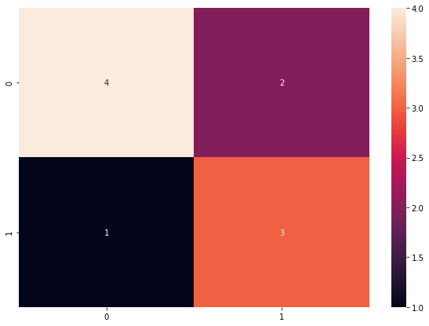

#MSE, Confusion Matrix


## 1. MSE(Mean Squared Error)


```python
y=np.array([1.,1.,1.,1.])
yTarget=np.array([0.8, 1.1,1.2,1.1])
np.square( (y-yTarget)**2  ).mean()
```

## 2. Confusion Matrix


```python
# Example of a confusion matrix in Python
from sklearn.metrics import confusion_matrix
import pandas as pd 
import numpy as np
import matplotlib.pyplot as plt

expected = [1, 1, 0, 1, 0, 0, 1, 0, 0, 0]
predicted = [1, 0, 0, 1, 0, 0, 1, 1, 1, 0]
results = confusion_matrix(expected, predicted)
print(results)
```


```python
# fail나면 root계정에서  "pip install seaborn" 명령 실행할 것. 

import seaborn as sn

df_cm = pd.DataFrame(results, range(2),
                  range(2))
plt.figure(figsize = (10,7))

sn.heatmap(df_cm, annot=True)
```


    

    

