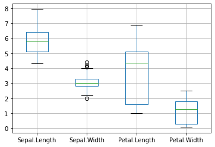

# Data Loading


```
import pandas as pd
![ ! -f  iris0.csv ]&&wget http://j.finfra.com/_file/iris0.csv
iris=pd.read_csv("iris0.csv")

```

# 기술통계


```
iris.describe()
```

# Histgram


```
hist = iris.hist(bins=10)
```

# BoxPlot


```
# 비모수적 데이터일 경우 많이 사용.
import matplotlib.pyplot as plt
iris.iloc[:,0:4].boxplot() 
```


    

    


# Pair Plot


```
import seaborn as sns
import warnings
sns.set_style("whitegrid");
warnings.filterwarnings("ignore")

# n차원의 데이터를 2차원으로 확인
sns.pairplot(iris,hue="Species",size=3);
plt.show()
```


```

```
