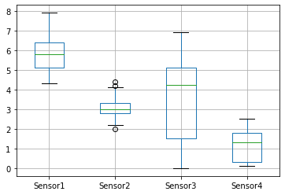
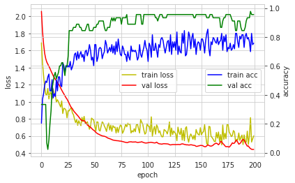
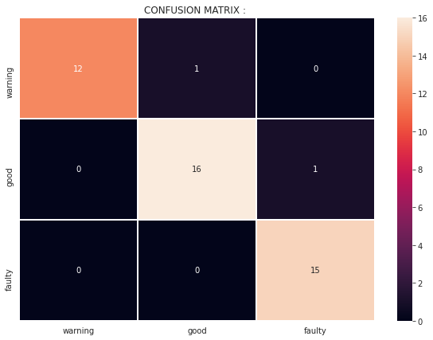

# 데이터 로딩


```

```


```
import pandas as pd
![ ! -f  plc1.csv ]&&wget http://j.finfra.com/_file/plc1.csv
plc=pd.read_csv("plc1.csv")
```

# 결측치 처리
* cf) https://rfriend.tistory.com/260


```
plc.head
```


```
plc.isnull().sum()
```


```

plc['Sensor3']=plc['Sensor3'].fillna(0)
plc['Sensor1']=plc['Sensor1'].fillna(0)

plc.isnull().sum()

```


```
plc.head

```

# 이상치 처리(Outlier Dection)
* [IQR 방법](https://wikidocs.net/89340)
  - IQR(InterQuartile Range)
  - IQR = 3 사분위 + 1 사분위


```
plc.describe()

```


```
quartile_1 = plc["Sensor1"].quantile(0.25)
quartile_3 = plc["Sensor1"].quantile(0.75) 
IQR= quartile_3 - quartile_1
search_df = plc[ (plc['Sensor1'] < (quartile_1 - 1.5 * IQR)) 
                | (plc['Sensor1'] > (quartile_3 + 1.5 * IQR))
                ]
```


```
search_df
```


```
plc=plc.drop(search_df.index, axis=0)
```


```
plc.shape
```

# 컬럼 추출


```
x=plc.iloc[:,2:6].values
y_text=plc.iloc[:,6:7]
y_text
```

# 1차 인코딩


```
sets=y_text.drop_duplicates()["State"].tolist()
encoder={k:v for v,k in enumerate(sets)}
y_num=[ encoder[i] for i in y_text["State"].tolist() ]
y_num[0:5]


```

# One-hot Encoding


```
import keras
y= keras.utils.to_categorical(y_num, len(sets))
y[0:5,:]
```

# 기술통계


```
plc.describe()
```

# Histgram


```
hist = plc.hist(bins=10)
```

# BoxPlot


```
import matplotlib.pyplot as plt
plc.iloc[:,2:6].boxplot() 
```


    

    


# Pair Plot


```
import seaborn as sns
import warnings
sns.set_style("whitegrid");
warnings.filterwarnings("ignore")

sns.pairplot(plc,hue="State",size=3);
plt.show()
```

# MLP Model


```
batch_size = 10
num_classes = 3
epochs = 200
```


```
import numpy as np
from tensorflow import keras
from tensorflow.keras.models import Sequential
from tensorflow.keras.layers import Dense
from keras import optimizers

import matplotlib.pyplot as plt
def hist_view(hist):
  print('## training loss and acc ##')
  fig, loss_ax = plt.subplots()
  acc_ax = loss_ax.twinx()

  loss_ax.plot(hist.history['loss'], 'y', label='train loss')
  loss_ax.plot(hist.history['val_loss'], 'r', label='val loss')

  loss_ax.set_xlabel('epoch')
  loss_ax.set_ylabel('loss')
  loss_ax.legend(loc='center')

  acc_ax.plot(hist.history['accuracy'], 'b', label='train acc')
  acc_ax.plot(hist.history['val_accuracy'], 'g', label='val acc')
  acc_ax.set_ylabel('accuracy')
  acc_ax.legend(loc='center right')

  plt.show()
```


```
x=plc.iloc[:,2:6].values
y_text=plc.iloc[:,6:7]

sets=y_text.drop_duplicates()["State"].tolist()
encoder={k:v for v,k in enumerate(sets)}
y_num=[ encoder[i] for i in y_text["State"].tolist() ]


```


```
# iris.target → y
y= keras.utils.to_categorical(y_num, num_classes)

from sklearn.model_selection import train_test_split
x_train,x_test,y_train,y_test=train_test_split(x,y,test_size=0.3,random_state=0)
x_train.shape,x_test.shape,y_train.shape,y_test.shape

```


```
from keras.layers import BatchNormalization, Dropout
from keras import regularizers

l2=regularizers.l2(l2=0.01)


model = Sequential()

model.add(Dense(6, activation='relu', input_shape=(4,)))
model.add(BatchNormalization())

model.add(Dense(4, activation='relu',kernel_regularizer=l2))
model.add(Dropout(0.2))

model.add(Dense(4, activation='relu',kernel_regularizer='l1'))
model.add(Dropout(0.2))
model.add(BatchNormalization())

model.add(Dense(num_classes, activation='softmax'))
model.summary()

```


```
adam=optimizers.Adam(0.001)
model.compile(loss='categorical_crossentropy',
              optimizer=adam,
              metrics=['accuracy'])

```


```
# batch_size,epochs
hist=model.fit(x_train, y_train,
          batch_size=batch_size,
          epochs=epochs,
          verbose=0,
          validation_data=(x_test, y_test))


```


```
hist_view(hist)
score = model.evaluate(x_test, y_test, verbose=0)
print('Test loss:', score[0])
print('Test accuracy:', score[1])

```


    

    


    Test loss: 0.4420098066329956
    Test accuracy: 0.9555555582046509


```
decoder = {k:v for k,v in enumerate( sets )}
decoder
```


```
r=np.argmax(model.predict(x_test[:10,:]), axis=-1)
[decoder[i] for i in r]
```

# Model Save

## 1. Weigth 정보의 저장


```
from google.colab import drive
drive.mount('/content/drive')
```


```
model.save("/content/drive/MyDrive/plt_model.h5")
```

## 2. 모델 구조 저장
* 모델은 Json파일로 저장되고 Weigth파일은 h5 형태로 저장


```
model_json = model.to_json()
with open("/content/drive/MyDrive/plt_model.json", "w") as json_file:
    json_file.write(model_json)

```

# Confusion Matrix


```
# Example of a confusion matrix in Python
from sklearn.metrics import confusion_matrix
import pandas as pd 
import numpy as np
import matplotlib.pyplot as plt

```


```
expected = np.argmax(y_test,axis=-1).tolist()
predicted = np.argmax(model.predict(x_test[:,:]), axis=-1)
results = confusion_matrix(expected, predicted)
print(results)
```


```
# fail나면 root계정에서  "pip install seaborn" 명령 실행할 것. 

import seaborn as sn

df_cm = pd.DataFrame(results, range(3),range(3))
plt.figure(figsize = (10,7))
plt.title("CONFUSION MATRIX : ")
# plt.ylabel('True Label')
# plt.xlabel('Predicted label')
sn.heatmap(df_cm, annot=True,xticklabels=sets, yticklabels=sets,fmt="d",linewidths=.5)
```


    

    


```

```


```

```
