Trains a simple deep NN on the IRIS dataset.


```python
import tensorflow as tf
import numpy as np
from tensorflow import keras
from tensorflow.keras.datasets import mnist
from tensorflow.keras.models import Sequential
from tensorflow.keras.layers import Dense, Dropout
from tensorflow.keras.optimizers import RMSprop
import matplotlib.pyplot as plt
def hist_view(hist):
  print('## training loss and acc ##')
  fig, loss_ax = plt.subplots()
  acc_ax = loss_ax.twinx()

  loss_ax.plot(hist.history['loss'], 'y', label='train loss')
  loss_ax.plot(hist.history['val_loss'], 'r', label='val loss')

  loss_ax.set_xlabel('epoch')
  loss_ax.set_ylabel('loss')
  loss_ax.legend(loc='center')

  acc_ax.plot(hist.history['accuracy'], 'b', label='train acc')
  acc_ax.plot(hist.history['val_accuracy'], 'g', label='val acc')
  acc_ax.set_ylabel('accuracy')
  acc_ax.legend(loc='center right')

  plt.show()
```


```python
batch_size = 50
num_classes = 3
epochs = 200
```


```python
import pandas as pd
![ ! -f  iris0.csv ]&&wget http://j.finfra.com/_file/iris0.csv
iris=pd.read_csv("iris0.csv")
iris
```


<div>
<style scoped>
    .dataframe tbody tr th:only-of-type {
        vertical-align: middle;
    }

    .dataframe tbody tr th {
        vertical-align: top;
    }

    .dataframe thead th {
        text-align: right;
    }
</style>
<table border="1" class="dataframe">
  <thead>
    <tr style="text-align: right;">
      <th></th>
      <th>Sepal.Length</th>
      <th>Sepal.Width</th>
      <th>Petal.Length</th>
      <th>Petal.Width</th>
      <th>Species</th>
    </tr>
  </thead>
  <tbody>
    <tr>
      <th>0</th>
      <td>5.1</td>
      <td>3.5</td>
      <td>1.4</td>
      <td>0.2</td>
      <td>setosa</td>
    </tr>
    <tr>
      <th>1</th>
      <td>4.9</td>
      <td>3.0</td>
      <td>1.4</td>
      <td>0.2</td>
      <td>setosa</td>
    </tr>
    <tr>
      <th>2</th>
      <td>4.7</td>
      <td>3.2</td>
      <td>1.3</td>
      <td>0.2</td>
      <td>setosa</td>
    </tr>
    <tr>
      <th>3</th>
      <td>4.6</td>
      <td>3.1</td>
      <td>1.5</td>
      <td>0.2</td>
      <td>setosa</td>
    </tr>
    <tr>
      <th>4</th>
      <td>5.0</td>
      <td>3.6</td>
      <td>1.4</td>
      <td>0.2</td>
      <td>setosa</td>
    </tr>
    <tr>
      <th>...</th>
      <td>...</td>
      <td>...</td>
      <td>...</td>
      <td>...</td>
      <td>...</td>
    </tr>
    <tr>
      <th>145</th>
      <td>6.7</td>
      <td>3.0</td>
      <td>5.2</td>
      <td>2.3</td>
      <td>virginica</td>
    </tr>
    <tr>
      <th>146</th>
      <td>6.3</td>
      <td>2.5</td>
      <td>5.0</td>
      <td>1.9</td>
      <td>virginica</td>
    </tr>
    <tr>
      <th>147</th>
      <td>6.5</td>
      <td>3.0</td>
      <td>5.2</td>
      <td>2.0</td>
      <td>virginica</td>
    </tr>
    <tr>
      <th>148</th>
      <td>6.2</td>
      <td>3.4</td>
      <td>5.4</td>
      <td>2.3</td>
      <td>virginica</td>
    </tr>
    <tr>
      <th>149</th>
      <td>5.9</td>
      <td>3.0</td>
      <td>5.1</td>
      <td>1.8</td>
      <td>virginica</td>
    </tr>
  </tbody>
</table>
<p>150 rows × 5 columns</p>
</div>


```python
# Shuffling
iriss=iris.sample(frac=1).reset_index(drop=True)
iris_train=iriss.iloc[0:100,:]
iris_test=iriss.iloc[100:150,:]

x_train=iris_train.iloc[:,0:4].values
x_test=iris_test.iloc[:,0:4].values
y_train=iris_train.iloc[:,4:5]
y_test=iris_test.iloc[:,4:5]

sets=iris.iloc[:,4:5].drop_duplicates()["Species"].tolist()
encoder={k:v for v,k in enumerate(sets)}
y_train=[ encoder[i] for i in y_train["Species"].tolist() ]
y_train = keras.utils.to_categorical(y_train, num_classes)

y_test=[ encoder[i] for i in y_test["Species"].tolist() ]
y_test = keras.utils.to_categorical(y_test, num_classes)
```


```python
# 데이터 shape 을 확인해 봅니다.
print(x_train.shape,y_train.shape,x_test.shape,y_test.shape)
```


```python
model = Sequential()
model.add(Dense(5, activation='relu', input_shape=(4,)))
model.add(Dense(5, activation='relu'))
model.add(Dense(5, activation='relu'))
model.add(Dense(num_classes, activation='softmax'))
model.summary()
model.save('tmp.h5')

```


```python
model.compile(loss='categorical_crossentropy',
              optimizer='adam',
              metrics=['accuracy'])

```


```python
model.load_weights('tmp.h5')
hist = model.fit(x_train, y_train,
                    batch_size=10,
                    epochs=10,
                    verbose=0,
                    validation_data=(x_test, y_test))

score = model.evaluate(x_test, y_test, verbose=0)
print('Test loss:', score[0])
print('Test accuracy:', score[1])
hist_view(hist)

```


    
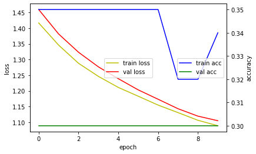
    


```python
y_train.shape ,x_train.shape
```


```python
model.load_weights('tmp.h5')
hist = model.fit(x_train, y_train,
                    batch_size=10,
                    epochs=20,
                    verbose=0,
                    validation_data=(x_test, y_test))

score = model.evaluate(x_test, y_test, verbose=0)
print('Test loss:', score[0])
print('Test accuracy:', score[1])
hist_view(hist)

```


    
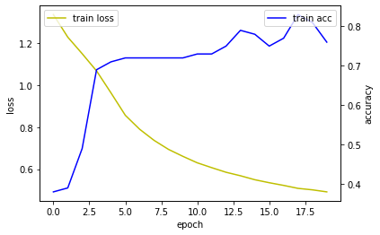
    


```python
model.load_weights('tmp.h5')
hist = model.fit(x_train, y_train,
                    epochs=100,
                    verbose=0,
                    validation_data=(x_test, y_test))

score = model.evaluate(x_test, y_test, verbose=0)
print('Test loss:', score[0])
print('Test accuracy:', score[1])
hist_view(hist)

```


    
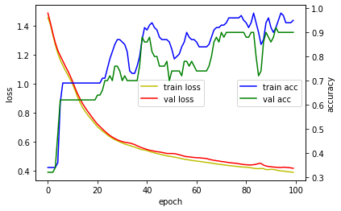
    


```python
hist.history.keys()

```


```python

```


```python

model.load_weights('tmp.h5')
hist = model.fit(x_train, y_train,
                    batch_size=10,
                    epochs=10,
                    verbose=0,
                    validation_data=(x_test, y_test))
score = model.evaluate(x_test, y_test, verbose=0)
print('Test loss:', score[0])
print('Test accuracy:', score[1])
hist_view(hist)

```


    
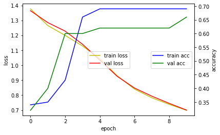
    


```python

model.load_weights('tmp.h5')
hist = model.fit(x_train, y_train,
                    batch_size=1,
                    epochs=10,
                    verbose=0,
                    validation_data=(x_test, y_test))
score = model.evaluate(x_test, y_test, verbose=0)
print('Test loss:', score[0])
print('Test accuracy:', score[1])
hist_view(hist)

```


    
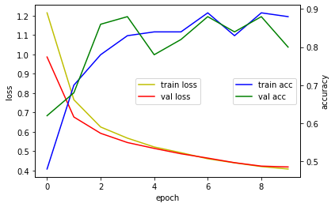
    


```python

model.load_weights('tmp.h5')
hist = model.fit(x_train, y_train,
                    batch_size=50,
                    epochs=10,
                    verbose=0,
                    validation_data=(x_test, y_test))
score = model.evaluate(x_test, y_test, verbose=0)
print('Test loss:', score[0])
print('Test accuracy:', score[1])
hist_view(hist)

```


    
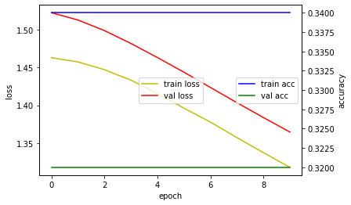
    


```python

model.load_weights('tmp.h5')
hist = model.fit(x_train, y_train,
                    batch_size=100,
                    epochs=10,
                    verbose=0,
                    validation_data=(x_test, y_test))
score = model.evaluate(x_test, y_test, verbose=0)
print('Test loss:', score[0])
print('Test accuracy:', score[1])
hist_view(hist)

```


    
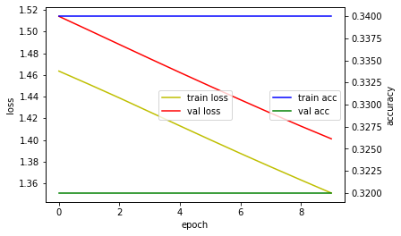
    


```python

model.load_weights('tmp.h5')
hist = model.fit(x_train, y_train,
                    batch_size=50,
                    epochs=500,
                    verbose=0,
                    validation_data=(x_test, y_test))
score = model.evaluate(x_test, y_test, verbose=0)
print('Test loss:', score[0])
print('Test accuracy:', score[1])
hist_view(hist)

```


    
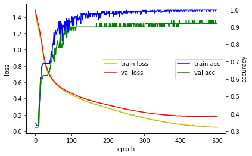
    


```python

model.load_weights('tmp.h5')
hist = model.fit(x_train, y_train,
                    batch_size=100,
                    epochs=1000,
                    verbose=0,
                    validation_data=(x_test, y_test))
score = model.evaluate(x_test, y_test, verbose=0)
print('Test loss:', score[0])
print('Test accuracy:', score[1])
hist_view(hist)

```


    
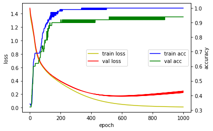
    


```python

model.load_weights('tmp.h5')
hist = model.fit(x_train, y_train,
                    batch_size=90,
                    epochs=10,
                    verbose=1,
                    validation_data=(x_test, y_test))
score = model.evaluate(x_test, y_test, verbose=0)
print('Test loss:', score[0])
print('Test accuracy:', score[1])
hist_view(hist)

```


    
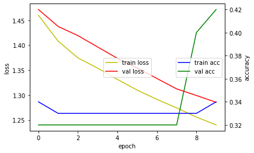
    


```python
# adam

model.load_weights('tmp.h5')
hist = model.fit(x_train, y_train,
                    batch_size=1,
                    epochs=10,
                    verbose=0,
                    validation_data=(x_test, y_test))
score = model.evaluate(x_test, y_test, verbose=0)
print('Test loss:', score[0])
print('Test accuracy:', score[1])
hist_view(hist)

```


    
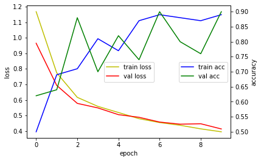
    


```python

model.load_weights('tmp.h5')
hist = model.fit(x_train, y_train,
                    batch_size=50,
                    epochs=500,
                    verbose=0,
                    validation_data=(x_test, y_test))
score = model.evaluate(x_test, y_test, verbose=0)
print('Test loss:', score[0])
print('Test accuracy:', score[1])
hist_view(hist)

```


    
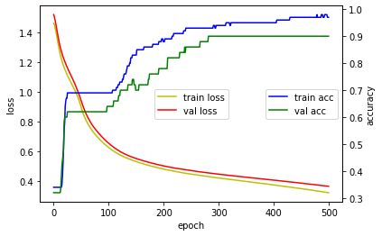
    


```python

model.load_weights('tmp.h5')
hist = model.fit(x_train, y_train,
                    batch_size=100,
                    epochs=1000,
                    verbose=0,
                    validation_data=(x_test, y_test))
score = model.evaluate(x_test, y_test, verbose=0)
print('Test loss:', score[0])
print('Test accuracy:', score[1])
hist_view(hist)

```


    
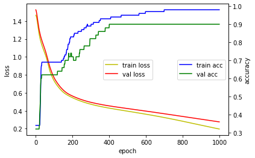
    


```python

```
